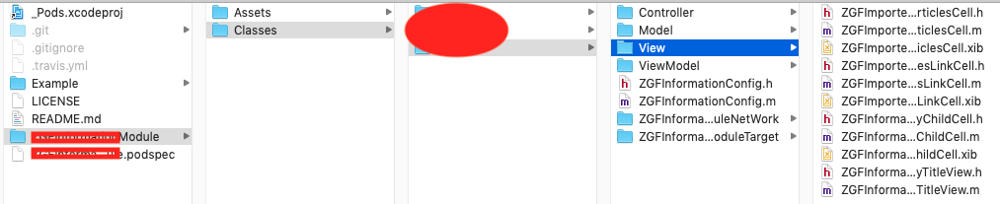
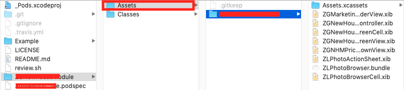

# podspac文件
CocoaPods是当前iOS工程中较为流行的依赖管理工具。它通过Podfile和几条基本命令就能帮助我们优雅地管理工程中的依赖库。<br/>
当然，我们难免会遇到需要自己创建pod库的情况。CocoaPods规定每个pod库都必须要有一份podspec文件。<br/>
在podspac中，需要填写pod库的作者信息、功能简介、版权信息等基本内容。具体语法可以参看[官方文档](https://guides.cocoapods.org/syntax/podspec.html)。<br/>
这里记录我在制作pod库是遇到的坑。

## 资源文件

### 资源文件的组织方式
方式一 `resources`
```
s.resources = [MoudleName/Assets/*]
```
媒体资源被加载到client target的main bundle中，依赖库的资源和主target的资源共同在同一个bundle下，会有命名冲突的问题。

方式二 `resource_bundles`
```
s.resource_bundles = {
    'bundleName' => [MoudleName/Assets/*.xcassets,MoudleName/Classes/**/*.xib]
}
```
如果pod库以动态库（framework）形式，资源被加载到子库framework的根目录下的MoudleName.bundle里。
* mainBundle的路径:/var/containers/Bundle/Application/E29A0452-3F0C-4774-A34F-B98A5C48A695/AppName.app  
* framework的路径：/var/containers/Bundle/Application/E29A0452-3F0C-4774-A34F-B98A5C48A695/Agent.app/Frameworks/PodName.framework ，即mainBundle/Frameworks/PodName.framework  
* pod库中bundle的路径：/var/containers/Bundle/Application/E29A0452-3F0C-4774-A34F-B98A5C48A695/Agent.app/Frameworks/PodName.framework/BundleName.bundle ，即mainBundle/Frameworks/PodName.frameworkBundleName.bundle 
<br/>
可以看到使用方式二`resource_bundles`，把资源文件分层级管理起来，而不是都在同一个根目录下，大大减少了命名冲突的可能。<br/>
如果pod库以静态库（.a）形式，资源被加载到主target的bundle中，与方式一resources的结果一样。<br/>
用 `resources` 属性指定的资源直接被拷贝到 client target（事实上CocoaPods会先运行脚本对 NIB，Asset Catalog，Core Data Model 等进行编译），这些资源无法享受 Xcode 的优化。这是官方文档的说法，但不清楚所指的优化是哪些（图片压缩？）<br/>
CocoaPods推荐我们使用`resource_bundles`的形式。


### 访问资源文件
当使用`resources`形式或者静态库形式，直接在main bundle中访问资源，`+ imageName:(NSString*)name` 方法就是直接访问 `[NSBundle mainBundle]`中的资源。<br/>
当使用 `resource_bundle`形式访问资源时，要先找到对用bundle，前面说到pod子库的bundle在对应的framework的根目录下，所以第一步找到framework
```
    //获取framework的bundle
    NSBundle *frameworkBundle = [NSBundle bundleForClass:className];
    //pod库中资源bundle的路径
    NSURL *url = [frameworkBundle URLForResource:resource withExtension:@"bundle"];
    //获取资源bundle
    NSBundle *bundle = [NSBundle bundleWithURL:url];
    UIImage *image;
    if (bundle) {
        //获取资源图片，这个方法在iOS8引入的
        image = [UIImage imageNamed:name inBundle:bundle compatibleWithTraitCollection:nil];
    } else {
        //防止pod库使用`resources`或者静态库形式
        image = [UIImage imageNamed:name];
    }
```
每次加载文件写怎么多会比较麻烦，可以写成UIImage的分类方法
```
+ (UIImage *)my_imageNamed:(NSString *)name bundleForClass:(nonnull Class)className resource:(NSString *)resource {
    NSBundle *frameworkBundle = [NSBundle bundleForClass:className];
    NSURL *url = [frameworkBundle URLForResource:resource withExtension:@"bundle"];
    NSBundle *bundle = [NSBundle bundleWithURL:url];
    UIImage *image;
    if (bundle) {
        image = [UIImage imageNamed:name inBundle:bundle compatibleWithTraitCollection:nil];
    } else {
        image = [UIImage imageNamed:name];
    }
    return image;
}
```

### xib资源文件
在开发中难免会用到xib，在发布pod库的时候可能会报错<br/>
错误一
```
Unable to run command 'StripNIB .nib' - this target might include its own product.
```
这个是资源文件命名冲突的错误，如果使用`resources`形式就要修改资源文件的名字，换成使用`resource_bundles`形式。<br/>

错误二
 ```
 error: invalid task ('StripNIB.nib') with mutable output but no other virtual output node (in target '')
 ```
这个是xib资源文件多次编译的问题，在podspac文件的`source_files`和`resource_bundles`/`resources`中同时包含了xib文件。<br/>
一般podspac文件中标记源文件和资源文件的方式：
```
    s.source_files = ['ModuleName/Classes/**/*']
    s.resource_bundles = {
        'ModuleName' => ['ModuleName/Assets/*']
    }
```
xib文件一般对应的controller或者view目录下。 <br/>

解决方法一：通过文件存放目录位置来解决，把xib文件都统一放在Assets中 <br/>

<br/>
解决方法二：修改podspac文件，在`source_file`和`resource_bundles`中现在文件类型，xib文件的目录位置不变。
<br/>
```
   s.source_files = [
    'ModuleName/Classes/Public/**/*.{h,m}',
    'ModuleName/Classes/Agent/**/*.{h,m}'
    ]
   s.resource_bundles = {
      'ModuleName' => [
      'ModuleName/Assets/Agent/**/*',
      'ModuleName/Assets/*.xcassets',
      'ModuleName/Classes/Public/**/*.xib'
      ]
    }
```

## pattern **
在编辑podspace文件是总会用到模糊匹配，对于 `**`的官方解释是
```
Pattern: **
Matches directories recursively.//递归的匹配目录
```
在实践中仍然会遇到坑。
```
- ERROR | [iOS] public_header_files: The pattern includes header files that are not listed in source_files
```
这个错误原因是，在`public_header_files`中指定的目录结构层级太深，需要修改文件的目录结构。
对于`**`的匹配总结
> 1. `public_header_files`，`resource_bundles`中的**不支持多级目录匹配
> 2. `source_files`,中的**支持多级目录的匹配
> 3. 推荐尽量使用简单的目录层级，不要太深


