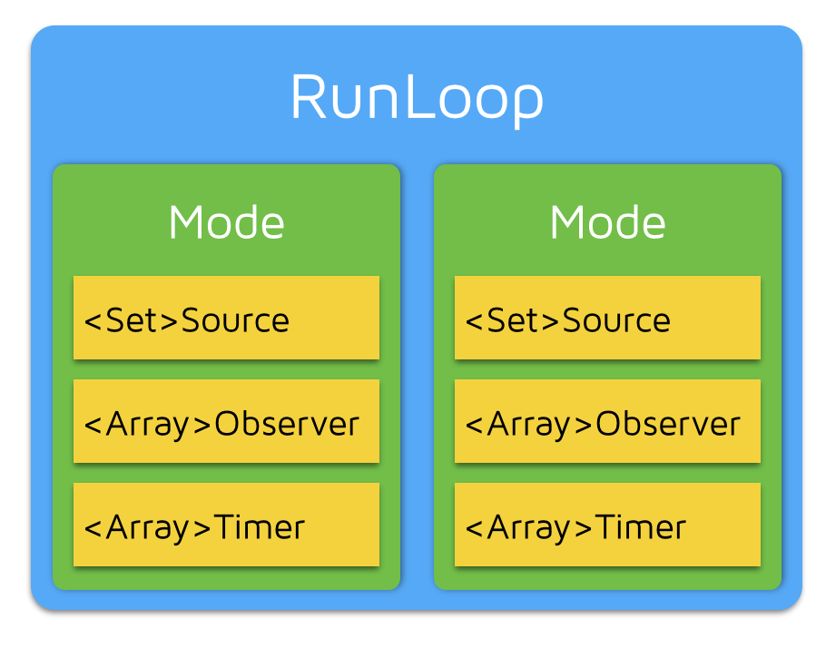
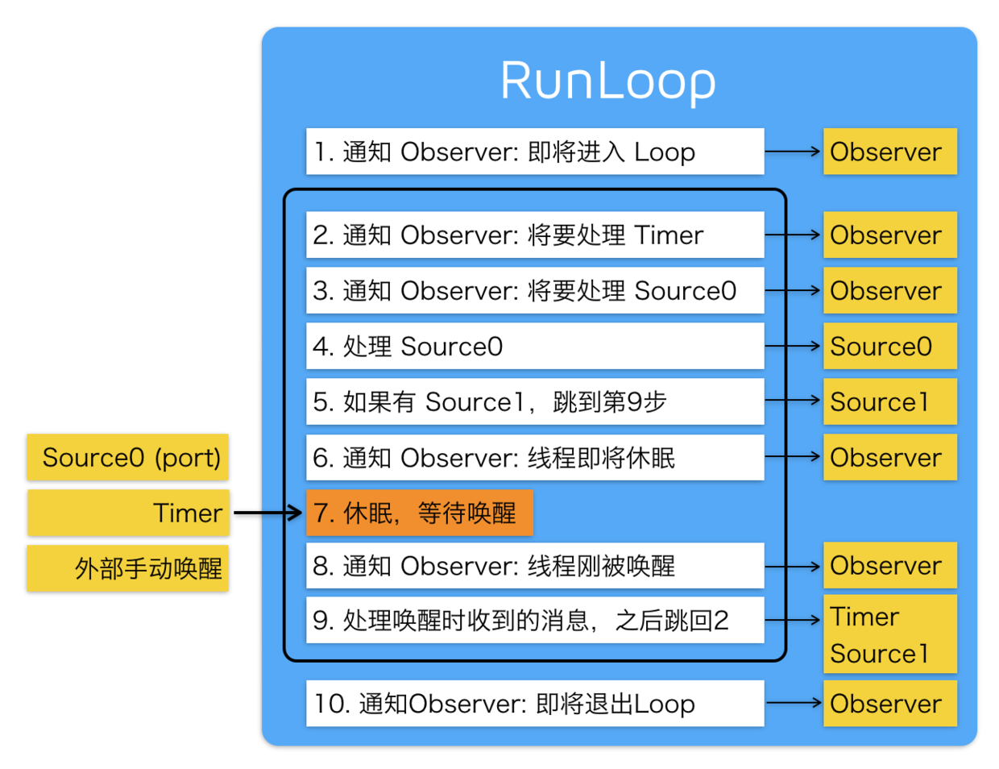

## 基本概念
runloop是一中"闲等待"循环，有事件发生时runloop被唤醒让线程忙起来，没有事件处理时runloop和线程进入休眠状态，以此保证线程不死。
runloop从input source和timer source中接收事件并在线程中处理事件。

## runloop与线程关系
runloop和线程是一一对应关系，每个线程(包括主线程)有一个runloop或者没有runloop。主线程肯定有runloop且在线程创建时runloop对象被创建并启动；
子线程默认没有runloop，当给线程发送runloop消息时才创建runloop但不启动（子线程的runloop是懒加载方式：在第一次调用子线程runloop的getter时创建然后返回runloop，当非首次调用时就直接返回）。获取runloop的代码
```objectivec
//1.OC Foundation框架中
// 获得当前线程的RunLoop对象，如果当前在主线程结果同[NSRunLoop mainRunLoop]；如果当前在子线程，runloop懒加载方式
[NSRunLoop currentRunLoop];
// 获得主线程的RunLoop对象
[NSRunLoop mainRunLoop];
//2.coreFoundation 框架中
// 获得当前线程的RunLoop对象
CFRunLoopGetCurrent();
// 获得主线程的RunLoop对象
CFRunLoopGetMain();
```
没有runloop线程也能处理事件，当任务完成后线程被销毁。<br/>
主线程添加runloop是为了让主线程不销毁一直能够接收事件。当主线程任务执行完，runloop进入休眠状态，继续监听事件，有事件要处理时runloop被唤起并执行任务。<br/>
子线程不添加runloop时，任务执行完就会销毁线程；添加runloop后，任务执行完线程也不会销毁，除非手动销毁runloop或线程。

## 工作方式
 
<br/>
图中清晰展示了runloop接收来自Input Source和Timers Source的事件，这也说明了为什么程序能自动接收到屏幕的点击事件(屏幕捕获产生触摸事件，
iOS系统处理事件并传递给活跃的application，application接收到事件后处理产生source0事件，主线程的runloop接收source0事件并处理)。<br/>

## 事件源
我们了解到runloop是用于处理事件的。具体说来，它可以处理有两类事件：Input Source和Timer Source。<br/>
Input Source可以分为三类
* Port-Based Sources，系统底层的Port事件，在应用层基本用不到
* Custom Input Sources，用户手动创建的Source
* Cocoa Perform Selector Sources， Cocoa提供的performSelector系列方法
<br/>
Timer Source就是指定的定时器事件

## Mode
由于runloop要处理的事件来源比较多，事件类型不同，对应的处理方式不同，为了便于处理事件引出了Mode的概念。

<br/>
model就是把不同的source、timer、observer分割开来，某一时刻runloop只能处理一个model中的任务。

```objectivec
NSDefaultRunLoopMode(kCFRunLoopDefaultMode (Core Foundation))  //默认Mode，通常主线程在此Mode下运行
NSConnectionReplyMode       //网络相关的mode，我们很少用到
NSModalPanelRunLoopMode    //事件辨别，
NSEventTrackingRunLoopMode  //跟踪界面，如拖拽、长按等连续的触摸事件，尤其处理ScrollView滑动时的各种触摸事件，保证流程滑动不受其他model的干扰
NSRunLoopCommonModes kCFRunLoopCommonModes (Core Foundation)//集合mode(NSDefaultRunLoopMode和UITrackingRunLoopMode)，一般用户插入的source都放在这里,
```

## Observer
runloop需要处理的事件很多，那么runloop什么时候开始处理哪种来源的事件，什么时候进入休眠和唤起状态呢？这些都是通过CFRunLoopObserverRef对象来监听runloop的变化。runloop开发的事件如下：
```objectivec
typedef CF_OPTIONS(CFOptionFlags, CFRunLoopActivity) {
    kCFRunLoopEntry = (1UL << 0),//即将进入一个runloop循环
    kCFRunLoopBeforeTimers = (1UL << 1),//即将处理timer事件
    kCFRunLoopBeforeSources = (1UL << 2),//即将处理input事件
    kCFRunLoopBeforeWaiting = (1UL << 5),//即将进入休眠状态
    kCFRunLoopAfterWaiting = (1UL << 6),//即将被唤起
    kCFRunLoopExit = (1UL << 7),//即将结束本循环
    kCFRunLoopAllActivities = 0x0FFFFFFFU//所有的状态
};
```

`CFRunLoopObserverRef`是专门用于监听runloop各种状态的对象，只能用这个类不能使用其他自定义类。下面是监听runloop事件的实例代码：
```objectivec
    //1.创建监听者
    //参数3:BOOL，是否重复监听    参数4:CFIndex，优先级，一般是0 
    CFRunLoopObserverRef observer = CFRunLoopObserverCreateWithHandler(CFAllocatorGetDefault(), kCFRunLoopAllActivities, YES, 0, ^(CFRunLoopObserverRef observer, CFRunLoopActivity activity) {
        switch (activity) {
            case kCFRunLoopEntry:
                NSLog(@"进入RunLoop");
                break;
            case kCFRunLoopBeforeTimers:
                NSLog(@"RunLoop要处理Timers");
                break;
            case kCFRunLoopBeforeSources:
                NSLog(@"RunLoop要处理input Source");
                break;
            case kCFRunLoopBeforeWaiting:
                NSLog(@"RunLoop要进入休眠");
                break;
            case kCFRunLoopAfterWaiting:
                NSLog(@"RunLoop要被唤起");
                break;
            case kCFRunLoopExit:
                NSLog(@"RunLoop要退出");
                break;
                
            default:
                break;
        }
    });
    //2.给runloop添加监听者
    //参数3:指定要监听runloop的哪种mode下的事件
    CFRunLoopAddObserver(CFRunLoopGetCurrent(), observer, kCFRunLoopDefaultMode);
    //3.释放observer，ARC不管理coreFoundation中的对象
    CFRelease(observer);
```
## timer
CFRunLoop中关于CFRunLoopTimerRef的方法基本已经在NSRunLoop正封装好了，我们可以使用NSTimer，它受RunLoop的Mode影响，处于timer的mode时才会执行定时方法。
```objectivec
//创建一个NSTimer定时器,默认情况下NSTimer是不会执行的,只有把NSTimer添加到RunLoop中,由RunLoop管理执行
NSTimer * timer = [NSTimer timerWithTimeInterval:1 target:self selector:@selector(show) userInfo:nil repeats:YES];

// 在当前线程中RunLoop添加一个timer, 并告诉runLoop, 这个timer只能在NSDefaultRunLoopMode模式下才能触发
// runLoop会找到NSDefaultRunLoopMode,然后把timer添加NSDefaultRunLoopMode中的Timer数组中
 [[NSRunLoop currentRunLoop] addTimer:timer forMode:NSDefaultRunLoopMode];

//利用此方法创建的NSTimer, 系统会自动放入当前线程中的currentRunLoop中,并且只能在NSDefaultRunLoop模式下才能触发
NSTimer * timer1 = [NSTimer scheduledTimerWithTimeInterval:1.0 target:self selector:@selector(show) userInfo:nil repeats:YES];
//但我们还是可以修改它的模式
[[NSRunLoop currentRunLoop] addTimer:timer1 forMode:NSRunLoopCommonModes];
```
## 思考
* 子线程什么时候会用到runloop
* 没有runloop线程也能处理事件，主线程添加runloop是为了不让主线程销毁。子线程添加runloop是为什么？？？？

