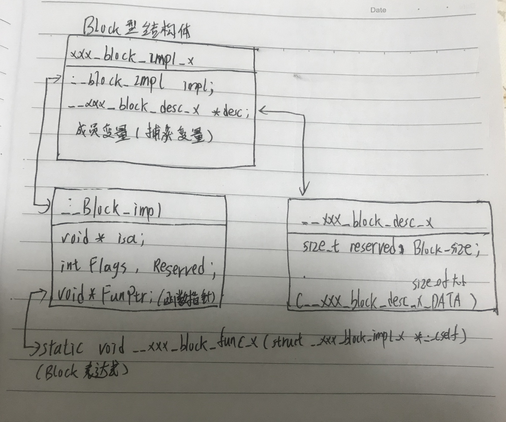
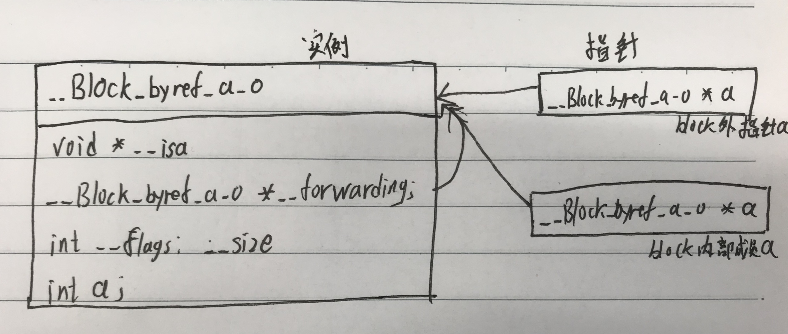
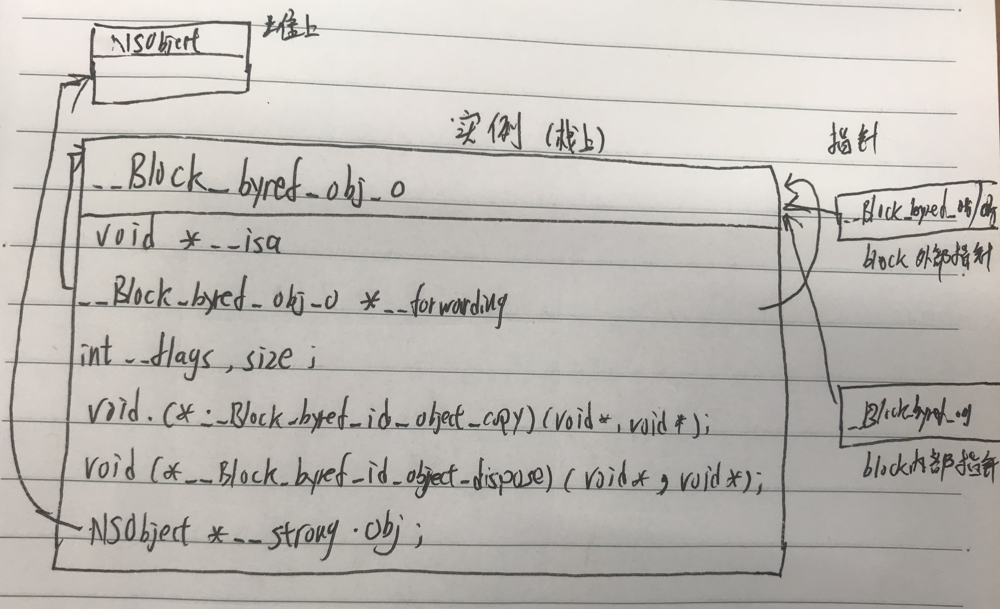
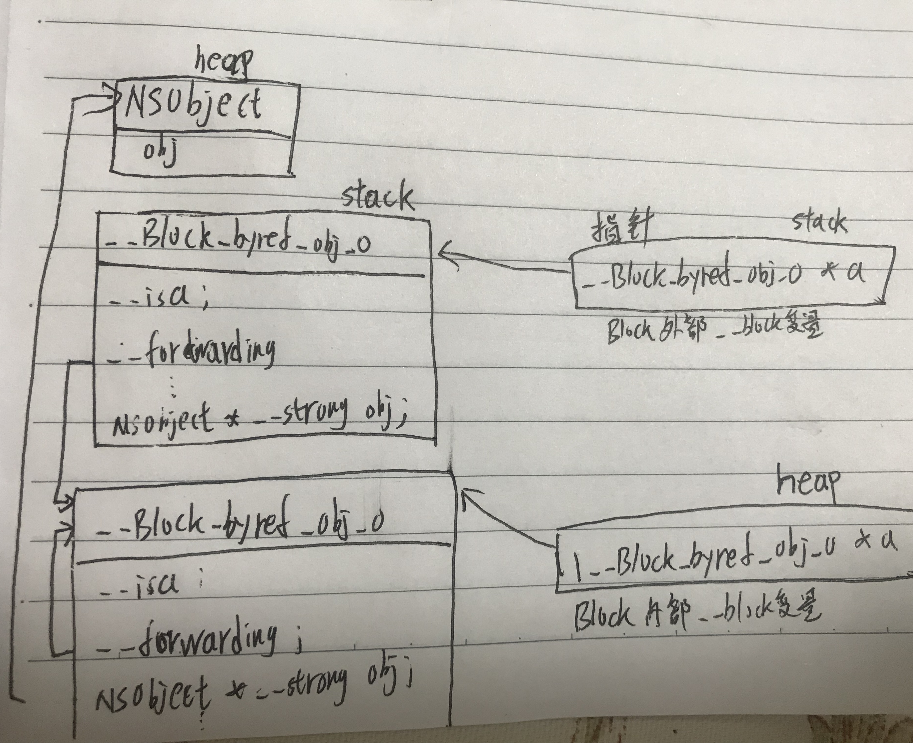
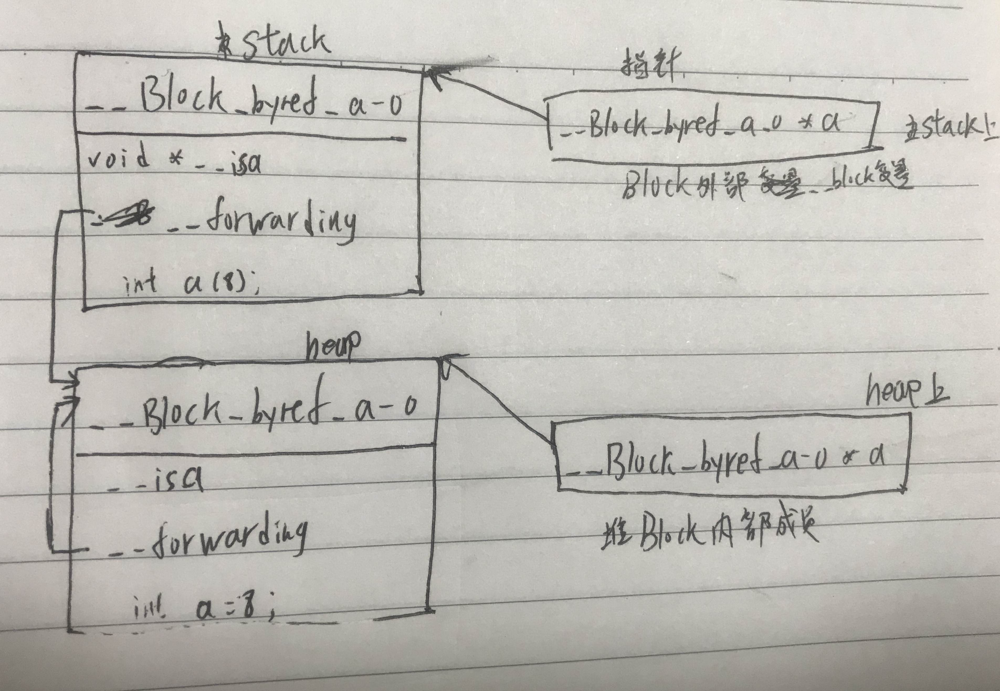

###
[上一篇](Block浅析.md)我们只是简单讲述了Block的使用方法，这篇文章我们就具体探究Block的实现和内存管理情况。这篇主要说明的问题
* Block到底是什么类型
* Block怎样捕获的外部变量
* 为什么使用__block修饰符就可以修改捕获的变量
* Block和其捕获对象的内存管理

## 名词解释
有必要先说明Block、blcok型变量、__block变量三者的含义不同
* Block指的是：含有表达式、参数、返回值的语法
* block型变量/block变量指的是：把bloc语法生成的block赋值给一个变量，这个变量指向的数据类型是block语法类型；实质就是个变量，跟C函数中的其他变量一样，可以作为全局局部静态动态变量，可以作为函数参数和返回值等使用。人们也常习惯把它称之为block
* __block变量指的是：使用__block修饰的变量，可以在Block内外部修改并保存其值。是一个机构体__Block_byref_xx_xx，含有__isa、__forwarding、变量、__flags、__size成员。

## Block编译后的代码实现
我们先来看这个简单改造后的main函数
```objectivec
int main(int argc, char * argv[]) {
    void (^blk)(void) = ^{
        NSLog(@"hellow block!");
    };
    blk();
}
```
编译后文件很长，很多都是跟Block无关的，我们先不看，搜索找到main函数，编译后的代码是这样的
```objectivec
int main(int argc, char * argv[]) {

    void (*blk)(void) = ((void (*)())&__main_block_impl_0((void *)__main_block_func_0, &__main_block_desc_0_DATA));
    
    ((void (*)(__block_impl *))((__block_impl *)blk)->FuncPtr)((__block_impl *)blk);
}
```
原来的两行代码，编译后也是两行，中间有很多类型转换，去掉之后是这样的：
```objectivec
//去掉类型转换后的代码
int main(int argc, char * argv[]) {
    //创建blk
    void (*blk)(void) = &__main_block_impl_0(__main_block_func_0, &__main_block_desc_0_DATA);
    //调用blk
    blk->FuncPtr(blk);
}
```
这里出现了陌生方法指针变量：__main_block_impl_0、__main_block_func_0、__main_block_desc_0_DATA、FuncPtr。
### __main_block_impl_0
```objectivec
struct __main_block_impl_0 {
  struct __block_impl impl;
  struct __main_block_desc_0* Desc;
  __main_block_impl_0(void *fp, struct __main_block_desc_0 *desc, int flags=0) {
    impl.isa = &_NSConcreteStackBlock;
    impl.Flags = flags;
    impl.FuncPtr = fp;
    Desc = desc;
  }
};
```
原来是一个结构体，有2个成员变量，一个构造方法。我们知道Block是一个结构体对象，这个就是Block结构体的定义。一般命名都是以__`文件名`_block_impl_`个数`，表示main文件的第一个Block结构体。下面在看看他的成员变量
```objectivec
struct __block_impl {
  void *isa;//Block的类型，stack，malloc，global这三中类型
  int Flags;//标记位，eg标记rentainCount、是否已经在堆上等
  int Reserved;
  void *FuncPtr;//
};

static struct __main_block_desc_0 {
  size_t reserved;//默认是0
  size_t Block_size;//大小，开辟__main_block_impl_0所需的空间大小
} __main_block_desc_0_DATA = { 0, sizeof(struct __main_block_impl_0)};

```
`__block_impl`:isa表示Block的类型；这个也说明Block也是一种对象。Flags跟objc_object中的mask一样是标记位，标记是否copy过等信息，默认为0；FuncPtr表示函数指针，存放Block的匿名函数，最终被赋值__main_block_func_0的地址。
`__main_block_desc_0`：记录__main_block_impl_0结构体的内存大小。<br/>
```objectivec
static void __main_block_func_0(struct __main_block_impl_0 *__cself) {
        NSLog((NSString *)&__NSConstantStringImpl__var_folders_r9_ydkfm4694mv65g46y2zqwz2m0000gn_T_main_7b6f1f_mi_0);
}
```
这里有NSLog这个关键字，我们编译的OC文件里只有Bloc表达是用到了这个，所以这里是Block表达式的匿名方法；编译器给这个匿名函数定义了一个名字'__main_block_func_0',所以Block是匿名这相对于程序员说的，编译器自动定义了名字。我们的表达式了就是定义了一个字符串常量，看看编译后的代码
```objectivec
static __NSConstantStringImpl __NSConstantStringImpl__var_folders_r9_ydkfm4694mv65g46y2zqwz2m0000gn_T_main_7b6f1f_mi_0 __attribute__ ((section ("__DATA, __cfstring"))) = {__CFConstantStringClassReference,0x000007c8,"hellow block!",13};
```
一个静态方法，这里看到OC把字符串常量保存在内存的data区，0x000007c8应该是字符串的地址。这个函数还有一个参数，这个参数传递的是block他自己，这与OC方法都有默认参数self一样的道理。<br/>
然后我们再回过头来看Block结构体的构造方法`__main_block_impl_0`,第一个参数是这个匿名函数的函数指针，第二个参数就是结构体需要的内存大小。<br/>
至此我们明白了block结构体对象的实现：
* Block实质是以___`文件名`_block_impl_`自定义Block的序号`命名的结构体。
* 结构体中保存匿名函数的地址，Block的isa指针、实例的内存空间大小
* block执行就是取到结构体实例中保存的函数地址，根据函数地址执行函数。<br/>

这个是实现Block的内存图：


## Block捕获变量
上面我们写的最简单的Block，那复杂点的：会捕获变量，有返回值会怎样呢？
```objectivec
    int a = 8;
    int (^blk)(void) = ^{
        NSLog(@"hellow block!");
        return a+10;
    };
    a = 10;
    blk();
```
还是先看看编译后的代码
```objectivec
    int a = 8;
    int (*blk)(void) = ((int (*)())&__main_block_impl_0((void *)__main_block_func_0, &__main_block_desc_0_DATA, a));
    a = 10;
    ((int (*)(__block_impl *))((__block_impl *)blk)->FuncPtr)((__block_impl *)blk);
```
与上一次相比，在构造block实例时多了一个参数a，我们再来看看定义Block的结构体有什么变化
```objectivec
struct __main_block_impl_0 {
  struct __block_impl impl;
  struct __main_block_desc_0* Desc;
  int a;
  __main_block_impl_0(void *fp, struct __main_block_desc_0 *desc, int _a, int flags=0) : a(_a) {
    impl.isa = &_NSConcreteStackBlock;
    impl.Flags = flags;
    impl.FuncPtr = fp;
    Desc = desc;
  }
};
```
结构体中也多出了一个成员变量a；构造函数的初始化列表中看到参数_a直接赋值给了a，我们再看看匿名函数里怎么使用这个变量的
```objectivec
  static int __main_block_func_0(struct __main_block_impl_0 *__cself) {
        int a = __cself->a; // bound by copy

        NSLog((NSString *)&__NSConstantStringImpl__var_folders_r9_ydkfm4694mv65g46y2zqwz2m0000gn_T_main_f37aa6_mi_0);
        return a+10;
    }
``` 
很明显，这里是通过cself指针取出捕获的变量，然后使用实现block的逻辑。至此我们知道了Block就是通过拷贝Block外部的变量实现捕获动作的。block内外变量实际是两个变量，当然外面修改了不会自动同步给block里面，所以这里程序执行的结果也必定是18，不是20；

### 捕获不同类型的变量
上面大致了解了block捕获外部变量的方式，变量有不同的种类，他们是捕获方式是否一致呢？
```objectivec
//全局变量，(全局/局部)静态变量，局部变量(传值型和引用型)
int gA = 10;
static int sb = 20;
int main(int argc, char * argv[]) {
    int a = 8;
    static int b = 6;
    NSObject *obj = [NSObject new];
    void (^blk)(void) = ^{
        gA += 10;
        sb += 10;
        b += 10;
        NSLog(@"global:%d,static global:%d,a:%d,b:%d,object:%@",gA,sb,a,b,obj);
    };
    a += 10;
    b += 10;
    gA += 10;
    sb += 10;
    blk();
}
//编译后Block结构体的定义
struct __main_block_impl_0 {
  struct __block_impl impl;
  struct __main_block_desc_0* Desc;
  int *b;//指针传递
  int a;//值传递
  NSObject *__strong obj;//强引用
  __main_block_impl_0(void *fp, struct __main_block_desc_0 *desc, int *_b, int _a, NSObject *__strong _obj, int flags=0) : b(_b), a(_a), obj(_obj) {
    impl.isa = &_NSConcreteStackBlock;
    impl.Flags = flags;
    impl.FuncPtr = fp;
    Desc = desc;
  }
};

//捕获对象型局部变量--使用__weak
    NSObject *obj = [NSObject new];
    //这行代码编译后是：__attribute__((objc_ownership(weak))) id wealObj = obj;
    __weak id wealObj = obj;
    void(^block)(void) = ^{
        NSLog(@"aaaaaaa%@",wealObj);
    };
//编译后
struct __main_block_impl_0 {
  struct __block_impl impl;
  struct __main_block_desc_0* Desc;
  __weak id wealObj;//弱引用
  //构造函数中捕获变量的类型也是__weak id
  __main_block_impl_0(void *fp, struct __main_block_desc_0 *desc, __weak id _wealObj, int flags=0) : wealObj(_wealObj) {
    impl.isa = &_NSConcreteStackBlock;
    impl.Flags = flags;
    impl.FuncPtr = fp;
    Desc = desc;
  }
};
```
小结：
* Block不用捕获全局变量、全局静态变量；
* 静态局部变量是指针传递(int *b;)，所以不加__block修饰符Block内外修改内容后可以同步；
* 局部数值型变量是通过传值方式捕获(copy一份:int a;)，Block内外修改内容后不能同步；
* 局部对象型变量是通过强引用来持有对象(NSObject *__strong obj )。这里也就解释了Block内可以修改对象属性的原因。
* 局部对象型变量是通过弱引用对象(__weak id wealObj = obj;)。
<br/>
Block捕获的对象不可以修改，实质是捕获变量指针所指向的内存空间不可修改。这个是通过编译器检查来控制的，而不是使用const声明，这就是把问题在编译阶段就避免，而不是运行后执行时暴露。

## __block修饰符的实现
```objectivec
    __block int a = 8;
    void (^blk)(void) = ^{
        a += 10;
    };
    a += 10;
    NSLog(@"%d",a);
    blk();
    NSLog(@"%d",a);
```

Block捕获带__block修饰符的变量，编译后的代码
```objectivec
struct __main_block_impl_0 {
  struct __block_impl impl;
  struct __main_block_desc_0* Desc;
  __Block_byref_a_0 *a; // by ref
  __main_block_impl_0(void *fp, struct __main_block_desc_0 *desc, __Block_byref_a_0 *_a, int flags=0) : a(_a->__forwarding) {
    impl.isa = &_NSConcreteStackBlock;
    impl.Flags = flags;
    impl.FuncPtr = fp;
    Desc = desc;
  }
};

struct __Block_byref_a_0 {
  void *__isa;//变量的类型，这里是int
__Block_byref_a_0 *__forwarding;//自己类型相同的一个指针
 int __flags;
 int __size;
 int a;//存储的值
};

//__block int a = 8 编译出的代码,调用了__Block_byref_a_0的构造方法
__attribute__((__blocks__(byref))) __Block_byref_a_0 a = {(void*)0,(__Block_byref_a_0 *)&a, 0, sizeof(__Block_byref_a_0), 8};
```
可以看到`__block int a = 8;`编译后不是简单的int型变量，而是一个__Block_byref_a_0型变量，Block结构体中多了`__Block_byref_a_0 *a`型成员变量，用于存放捕获的变量。
`__Block_byref_a_0`也是一个结构体，这个结构体的构造方法的第二个参数&a就是给__forwarding成员变量赋值即__forwarding指针指向了自己本身；最后一个参数8才是要存储的值，保存在`int a`成员变量中。而在Block结构体的构造函数的初始化列表`a(_a->__forwarding)`,把Block里面的__Block_byref_a_0指针指向了外面的__Block_byref_a_0，即Block内外的变量指向了同块内存。__block修饰的变量的内存结构如图：

我们再看看匿名函数中是怎样使用这个变量的
```objectivec
//Block内部修改__block变量
static void __main_block_func_0(struct __main_block_impl_0 *__cself) {
  __Block_byref_a_0 *a = __cself->a; // bound by ref

        (a->__forwarding->a) += 10;
    }
    
//Block外部修改__block变量  
(a.__forwarding->a) += 10;
```
在访问__Block_byref_a_0变量时都是通过__forwarding获取的地址，这样就实现了Block内外修改同一块地址。<br/>
当__block修饰对象型变量时会怎样呢？我们修改OC代码
```objectivec
    __block NSObject *obj = [NSObject new];
    void (^blk)(void) = ^{
        obj = [NSObject new];
    };
    NSLog(@"%@",obj);
    blk();
    NSLog(@"%@",obj);
```
编译之后__block变量的结构体定义是这样
```objectivec
struct __Block_byref_obj_0 {
  void *__isa;
__Block_byref_obj_0 *__forwarding;
 int __flags;
 int __size;
 void (*__Block_byref_id_object_copy)(void*, void*);//函数指针
 void (*__Block_byref_id_object_dispose)(void*);//函数指针
 NSObject *__strong obj;//强引用实例
};
```
同样也是有__forwarding指针，由于__block修饰的是对象，所以这里多了NSObject的内存分配，定义好之后的内存结构如图：

小结：
使用__block修饰变量时，实质是创建了一个结构体__Block_Byref_xxx，在结构体中保存变量；Block内部捕获__Block_Byref结构体，这样Block内外的变量指针都指向__Block_Byref_xxx结构体，修改变量的实质是修改了__Block_Byref_xxx结构体的成员变量(不修改结构体本身)。这也就实现了Block内外修改会同步的功能。

## Block的内存管理
通过查看编译后的代码，我们知道Block本身是结构体类型，他们的内存管理方式也不同；global类型Block的内存在静态区；stack类型Block内存在栈区；malloc类型Block内存在堆区；栈和静态区内存由系统自动化管理，堆区内存需要我们自己管理。
### stack类型copy到堆上时机
mallock类型的Block都是由stack类型copy到堆上形成的。下面是总结的copy时机：
* 调用Block的copy函数，eg：`=`
* Block作为函数返回值，会自动copy到堆上并添加到autoreleasePool中；Block作为函数参数类型不变，引用计数也不变。
* Block赋值给__strong修饰的id指针或__strong修饰的类成员变量
* Cocoa 框架里usingBlock的方法和GCD中传递Block的API

既然OC中把Block也看作是对象，就应该有retian和release操作，
retain(copy)的实现：执行`_Block_copy_internal`方法(对Block对象的retain)，如果实现了`xxx_block_copy_xxx`就执行(Block类的成员变量的内存管理)<br/>
release的实现：如果实现了`xxx_block_dispose_xxx`就执行(Block类的成员变量的内存管理)，执行`_Block_release`方法(对Block对象的release)<br/>
实现`xxx_block_copy_xxx`和`xxx_block_dispose_xxx`的时机：Block表达式内部捕获了外部引用型变量，eg：id、NSOBject，Block, __block、__weak、__strong修饰的变量

### Block本身的copy
```objectivec
//Block本身的copy方法
static void *_Block_copy_internal(const void *arg, const bool wantsOne) {
    struct Block_layout *aBlock;
    if (!arg) return NULL;   
    
    aBlock = (struct Block_layout *)arg;
    //已经copy过，就让引用计数+1
    if (aBlock->flags & BLOCK_NEEDS_FREE) {
        // latches on high
        latching_incr_int(&aBlock->flags);
        return aBlock;
    }
    //BLOCK_IS_GC,？？？？
    else if (aBlock->flags & BLOCK_IS_GC) {
        // GC refcounting is expensive so do most refcounting here.
        if (wantsOne && ((latching_incr_int(&aBlock->flags) & BLOCK_REFCOUNT_MASK) == 2)) {
            // Tell collector to hang on this - it will bump the GC refcount version
            _Block_setHasRefcount(aBlock, true);
        }
        return aBlock;
    }
    //Globall类型Block，什么都不做
    else if (aBlock->flags & BLOCK_IS_GLOBAL) {
        return aBlock;
    }

    // 从栈拷贝到堆
    if (!isGC) {
        struct Block_layout *result = malloc(aBlock->descriptor->size);
        if (!result) return NULL;
        memmove(result, aBlock, aBlock->descriptor->size); // bitcopy first
        // reset refcount
        result->flags &= ~(BLOCK_REFCOUNT_MASK|BLOCK_DEALLOCATING);    // XXX not needed
        result->flags |= BLOCK_NEEDS_FREE | 2;  //从栈copy到堆上的同时把标记位BLOCK_NEEDS_FREE置为1，代表Block对象已在堆上了
        result->isa = _NSConcreteMallocBlock;//更新Block的类型
        _Block_call_copy_helper(result, aBlock);
        return result;
    }
    else {
        //isGC，就是Block内部的一个autoBlock类型，跟我们理解的global类型效果一样，只不过二者的内部实现不一样。
        //autoBlock类型产生的时机：在非全局语法区(eg:函数方法里)创建了一个没有捕获外部变量的Block(编译后还是stack类型)，当给这类Block执行copy时
        //....
        //创建layout的方式跟上面不同
        struct Block_layout *result = _Block_allocator(aBlock->descriptor->size, wantsOne, hasCTOR || _Block_has_layout(aBlock));
        if (!result) return NULL;
        memmove(result, aBlock, aBlock->descriptor->size); // bitcopy first
        // reset refcount
        // if we copy a malloc block to a GC block then we need to clear NEEDS_FREE.
        flags &= ~(BLOCK_NEEDS_FREE|BLOCK_REFCOUNT_MASK|BLOCK_DEALLOCATING);   // XXX not needed
        //flags的设置方式与上面不同
        if (wantsOne)
            flags |= BLOCK_IS_GC | 2;
        else
            flags |= BLOCK_IS_GC;
        result->flags = flags;
        _Block_call_copy_helper(result, aBlock);
        if (hasCTOR) {
            result->isa = _NSConcreteFinalizingBlock;
        }
        else {
            result->isa = _NSConcreteAutoBlock;//Block的类型，特殊类型
        }
        return result;
    }
}


//Block本身的release方法
BLOCK_EXPORT void _Block_release(const void *arg) {
    struct Block_layout *aBlock = (struct Block_layout *)arg;
    //block为nil、全局Block时不作处理
    if (!aBlock 
        || (aBlock->flags & BLOCK_IS_GLOBAL)
        || ((aBlock->flags & (BLOCK_IS_GC|BLOCK_NEEDS_FREE)) == 0)
        ) return;
    if (aBlock->flags & BLOCK_IS_GC) {
        if (latching_decr_int_now_zero(&aBlock->flags)) {
            _Block_setHasRefcount(aBlock, false);
        }
    }
    //malloc类型Block且引用计数大于1
    else if (aBlock->flags & BLOCK_NEEDS_FREE) {
        //latching_decr_int_should_deallocate会让Blcok本身引用计数-1
        if (latching_decr_int_should_deallocate(&aBlock->flags)) {
            //Block的引用计数为0时
            _Block_call_dispose_helper(aBlock);
            _Block_destructInstance(aBlock);//如果Block实现了xxx_block_dispose_xxx就调用
            _Block_deallocator(aBlock);
        }
    }
}
```
### Block捕获的成员变量的retain和release
```objectivec
//相当于对象的retain方法
static void __main_block_copy_0(struct __main_block_impl_0*dst, struct __main_block_impl_0*src) {_Block_object_assign((void*)&dst->obj, (void*)src->obj, 3/*BLOCK_FIELD_IS_OBJECT*/);}
//相当于对象的release方法
static void __main_block_dispose_0(struct __main_block_impl_0*src) {_Block_object_dispose((void*)src->obj, 3/*BLOCK_FIELD_IS_OBJECT*/);}
//在runtime.c/runtime.cpp文件中找到实现

//标记Block中捕获的成员变量的内存管理方式
// Values for _Block_object_assign() and _Block_object_dispose() parameters
enum {
    // see function implementation for a more complete description of these fields and combinations
    BLOCK_FIELD_IS_OBJECT   =  3,  // id, NSObject, __attribute__((NSObject)), block, ...
    BLOCK_FIELD_IS_BLOCK    =  7,  // a block variable
    BLOCK_FIELD_IS_BYREF    =  8,  // the on stack structure holding the __block variable
    BLOCK_FIELD_IS_WEAK     = 16,  // declared __weak, only used in byref copy helpers
    BLOCK_BYREF_CALLER      = 128, // called from __block (byref) copy/dispose support routines.
};

BLOCK_EXPORT
void _Block_object_assign(void *destAddr, const void *object, const int flags) {
    switch (os_assumes(flags & BLOCK_ALL_COPY_DISPOSE_FLAGS)) {
      case BLOCK_FIELD_IS_OBJECT:
        /*******OC实例代码
        id object = ...;
        [^{ object; } copy];
        ********/
        //Block中捕获id变量，当这个Block执行copy时
            
        _Block_retain_object(object);//retain新值
        _Block_assign((void *)object, destAddr);//release旧值(destAddr)，并保存新值的地址
        break;

      case BLOCK_FIELD_IS_BLOCK:
        /*******
        void (^object)(void) = ...;
        [^{ object; } copy];
        ********/
        //BlockA中捕获了其他BlockB,当BlockA执行copy时

        //xx = _Block_copy_internal(object, false)是retain新值(BlockB执行copy或retian)
        //_Block_assign(xx,destAddr)release旧值(destAddr)，并保存新值的地址
        _Block_assign(_Block_copy_internal(object, false), destAddr);
        break;
    
      case BLOCK_FIELD_IS_BYREF | BLOCK_FIELD_IS_WEAK://24
      case BLOCK_FIELD_IS_BYREF:
        /*******
         // copy the onstack __block container to the heap
         __block ... x;
         __weak __block ... x;
         [^{ x; } copy];
         ********/
         //捕获__block修饰的变量
        
        _Block_byref_assign_copy(destAddr, object, flags);
        break;
        
      case BLOCK_BYREF_CALLER | BLOCK_FIELD_IS_OBJECT://131
      case BLOCK_BYREF_CALLER | BLOCK_FIELD_IS_BLOCK://135
        /*******
         // copy the actual field held in the __block container
         __block id object;
         __block void (^object)(void);
         [^{ object; } copy];
         ********/

        // under manual retain release __block object/block variables are dangling
        _Block_assign((void *)object, destAddr);
        break;

       .........
       
      default:
        break;
    }
}

BLOCK_EXPORT
void _Block_object_dispose(const void *object, const int flags) {
    switch (os_assumes(flags & BLOCK_ALL_COPY_DISPOSE_FLAGS)) {
      case BLOCK_FIELD_IS_BYREF | BLOCK_FIELD_IS_WEAK:
      case BLOCK_FIELD_IS_BYREF:
        // get rid of the __block data structure held in a Block
        _Block_byref_release(object);//释放_Block_byref
        break;
      case BLOCK_FIELD_IS_BLOCK:
        _Block_destroy(object);
        break;
      case BLOCK_FIELD_IS_OBJECT:
        _Block_release_object(object);
        break;
      case BLOCK_BYREF_CALLER | BLOCK_FIELD_IS_OBJECT:
      case BLOCK_BYREF_CALLER | BLOCK_FIELD_IS_BLOCK:
      case BLOCK_BYREF_CALLER | BLOCK_FIELD_IS_OBJECT | BLOCK_FIELD_IS_WEAK:
      case BLOCK_BYREF_CALLER | BLOCK_FIELD_IS_BLOCK  | BLOCK_FIELD_IS_WEAK:
        break;
      default:
        break;
    }
}
```
源码分析都在贴的代码注释当中！！！<br/>

小结：
* 从栈copy到堆上时，在堆上开辟新内存空间存放Block本身，也对Block中捕获的成员变量做相应的内存处理(+1或深拷贝)
* 堆上的Block销毁时，会对Block捕获的成员变量做相应的内存处理(-1或销毁)，然后再销毁Block本身；这样使成员变量的引用达到平衡
* Block的copy，对于stack类型来说是深拷贝；对于malloc类型来说是浅拷贝(避免不必要的内存浪费),引用计数+1；对gloal类型是空操作
* 当捕获的成员变量使用__block、__weak、__strong修饰或者类型是NSObject、id、Block时都对其进行内存引用管理


## forwarding存在的意义
当使用__block修饰的变量被Block捕获时，会相应产生`_Block_byref`结构体以及其成员变量的copy操作。且只当__block修饰的是引用型对象时才会有`_Block_byref`结构体成员变量的copy和release操作。Block的其成员变量Block_Byref的retian和release操作是：
```objectivec
static void __main_block_copy_0(struct __main_block_impl_0*dst, struct __main_block_impl_0*src) {_Block_object_assign((void*)&dst->obj, (void*)src->obj, 8/*BLOCK_FIELD_IS_BYREF*/);}

static void __main_block_dispose_0(struct __main_block_impl_0*src) {_Block_object_dispose((void*)src->obj, 8/*BLOCK_FIELD_IS_BYREF*/);}
```
Block的copy方法调用`_Block_object_assign`方法，当传递的类型是BLOCK_FIELD_IS_BYREF时会调用到`_Block_byref_assign_copy`方法，这个方法是对__block变量的copy操作：
```objectivec
static void _Block_byref_assign_copy(void *dest, const void *arg, const int flags) {
    struct Block_byref **destp = (struct Block_byref **)dest;
    struct Block_byref *src = (struct Block_byref *)arg;
     
     //1.copy或retian新值
    if (src->forwarding->flags & BLOCK_BYREF_IS_GC) {
        ;   // don't need to do any more work
    }
    else if ((src->forwarding->flags & BLOCK_REFCOUNT_MASK) == 0) {
        //开始拷贝：copy from stack to heap 
        ...
        struct Block_byref *copy = (struct Block_byref *)_Block_allocator(src->size, false, isWeak);//堆上的对象
        copy->forwarding = copy; // forwarding指向本身
        src->forwarding = copy;  // src是栈上的对象，forwarding指向了堆上的对象。
        copy->size = src->size;
        if (isWeak) {//标记Block_byref是__weak修饰
            copy->isa = &_NSConcreteWeakBlockVariable;  // mark isa field so it gets weak scanning
        }
        //Block_byref内强引用了其他对象
        if (src->flags & BLOCK_BYREF_HAS_COPY_DISPOSE) {
            // Trust copy helper to copy everything of interest
            // If more than one field shows up in a byref block this is wrong XXX
            struct Block_byref_2 *src2 = (struct Block_byref_2 *)(src+1);
            struct Block_byref_2 *copy2 = (struct Block_byref_2 *)(copy+1);
            copy2->byref_keep = src2->byref_keep;
            copy2->byref_destroy = src2->byref_destroy;

            if (src->flags & BLOCK_BYREF_LAYOUT_EXTENDED) {
                struct Block_byref_3 *src3 = (struct Block_byref_3 *)(src2+1);
                struct Block_byref_3 *copy3 = (struct Block_byref_3*)(copy2+1);
                copy3->layout = src3->layout;
            }

            //执行Block_byref的保存的retian和release方法，__Block_byref_id_object_copy_131
            (*src2->byref_keep)(copy, src);
        }
        else {
            // just bits.  Blast 'em using _Block_memmove in case they're __strong
            // This copy includes Block_byref_3, if any.
            _Block_memmove(copy+1, src+1,
                           src->size - sizeof(struct Block_byref));
        }
    }
    // already copied to heap
    else if ((src->forwarding->flags & BLOCK_BYREF_NEEDS_FREE) == BLOCK_BYREF_NEEDS_FREE) {
        latching_incr_int(&src->forwarding->flags);
    }
    
    //2.release旧值
    // assign byref data block pointer into new Block
    _Block_assign(src->forwarding, (void **)destp);
}
```
__block变量的结构体如下：
```objectivec
struct __Block_byref_obj_0 {
  void *__isa;
__Block_byref_obj_0 *__forwarding;
 int __flags;
 int __size;
 void (*__Block_byref_id_object_copy)(void*, void*);//成员变量obj的copy方法
 void (*__Block_byref_id_object_dispose)(void*);//成员变量obj的release方法
 NSObject *__strong obj;
};

static void __Block_byref_id_object_copy_131(void *dst, void *src) {
 _Block_object_assign((char*)dst + 40, *(void * *) ((char*)src + 40), 131);//131就是上面枚举的BLOCK_BYREF_CALLER+BLOCK_FIELD_IS_OBJECT
}
static void __Block_byref_id_object_dispose_131(void *src) {
 _Block_object_dispose(*(void * *) ((char*)src + 40), 131);//131就是上面枚举的BLOCK_BYREF_CALLER+BLOCK_FIELD_IS_OBJECT
}
```
可以看到当拷贝__block变量时也伴随着Block_byref成员变量的copy。至此我们知道了，捕获__block变量的Block拷贝过程：
* 1.拷贝Block结构体本身 
* 2.拷贝__Block_byref_obj_0结构体到堆上,堆上的forwarding指向自己，栈上的forwarding指向堆上的结构体对象； 
* 3.Block_byref的成员变量的内存操作(__Block_byref_id_object_copy_131)。


这个是完成拷贝之后的内存结构图：

当__block修饰的是值类型变量时__Block_byref的结构体：
```objectivec
struct __Block_byref_a_0 {
  void *__isa;
__Block_byref_obj_0 *__forwarding;
 int __flags;
 int __size;
 int a;
};
```
可以看到__Block_byref_a_0结构体中没有成员变量的copy和dispose方法，因为修饰的是int值类型。这个时候__block变量的copy就是简单的__Block_byref结构体本身的copy。这个是copy后的内存图：

这样就可以保证无论是栈上的__block变量还是堆上的__block变量，最终修改的都是同一块地址；同时也就解释了__forwording指针存在的原因了。Block_byref结构体保证Block内外修改的同步，forwording保证从栈拷贝到堆上时Block内外变量修改的同步。


## Block中的循环引用
了解了无论是Block结构体、__block变量结构体，他们都是对象，都需要进行内存管理。都要避免循环引用。可以使用__block、__weak、__unsafe_unretained都可以打破循环引用
* __block优点：可以控制对象的持有期间。缺点：block语法引起循环引用，执行block打破循环引用，这样导致block必须执行
* __weak优点：直接打破循环引用，缺点：可能在执行block时变量已经被置为nil。逻辑不完整
* __unsafe_unretained优点：直接打破循环引用 缺点：在执行block时变量被释放导致野指针
    

