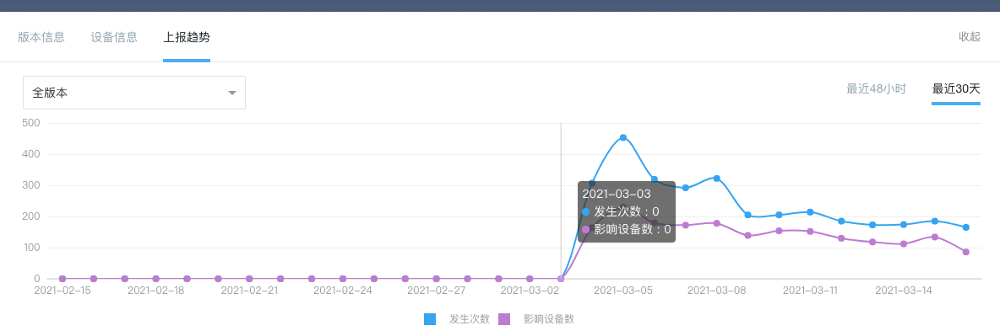
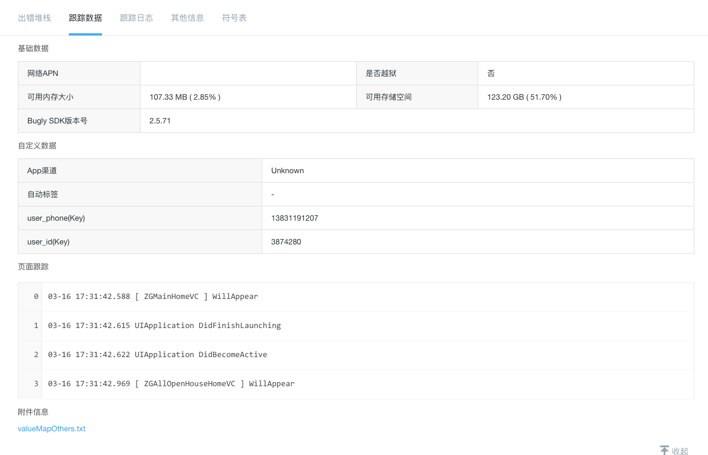

## bugly上收集信息：
 

看到这个统计信息，首先想到的是不是MJExtension库的问题，检查使用的不是最新版本，如果这个时候直接升级MJExtension，那这个问题解决效率就很低且不负责任，对于新版本是否解决了我们出现的这个问题不确定。
那既然这么说我去github上找找看是否有此issues，发现还真有。 
https://github.com/CoderMJLee/MJExtension/pull/786 
https://github.com/CoderMJLee/MJExtension/issues/761 
https://github.com/CoderMJLee/MJExtension/pull/798 
https://github.com/CoderMJLee/MJExtension/issues/736 

那是不是就确定升级库就可以让crash下去了吗？仔细看这些问题在786的问题里解决了，解决方式是： 
  
在for-in循环里做了copy操作 
这里补充下for-in、block的enumerate都不允许在遍历数组过程中add、remove的操作。我们项目里对数据模型就是解析，也没有修改过数据模型，显然这个解决方式也不确定就一定能解决。 
所以到现在考虑升级库的方式基本算是不通了。 

## 现在考虑复现问题：
如果要复现这个问题了，就需求对bugly上的信息做全面分析 
版本信息： 
  
最近几个版本都有发生，应该不是某个特定版本的问题 

发生设备信息： 
  
可能是iOS14的问题，找测试机在iOS14上使用最新版本没有复现这个问题 

发生时间： 
  
在3月3号晚上我们接口上了强更提示的功能，之前的新版本4590很早之前就发布了，且有一部分更新用户；因此猜测可能是新旧版本的问题。 
到这里才下载了一个低版本包尝试复现，这个时候发现能复现且必现，跟踪代码发现是接口返回的数据类型问题。  
到此这个那个问题已经解决。 

## 用户行为路径
其实在使用低版本之前，我还根据bugly上标记的用户id，在神策用户行为统计上尝试找复现路径，但后来发现强大的bugly上已有页面切换记录。完全不用在使用其他系统查找复现路径。 
 
 
使用神策找不到复现路径后，我开始在堆栈信息里仔细找线索，搜索 `SIGSEGV`关键词都了很多弯路没有找到问题突破点

## 总结解决线上问题的方式和工具

- 一般都会集成三方crash统计库，可以直接在上面查看定位到具体类和代码行的crash
- 三方crash库不能定位到具体代码行的，可以使用xcode-window- organizer-选择对应的应用和crash,openInProject中有些可以定位到代码行和堆栈信息
- 通过xcode打开特定手机上的log日志具体查看，这个一般要结合.dSYM文件查
- 分析信息的时候我们可以多看看crash发生的路径、版本、系统版本、设备机型、0号案例发生的时间等信息综合考察，总结问题发生的各种条件，最终复现问题，进而解决问题

## NSException这个类可以让程序员在崩溃时自己收集堆栈信息并处理

## dSYM文件是解析app的堆栈信息，还有很多系统方法，就要用到系统符号文件。系统符号化文件对设备的架构系统版本要一一对应才可以解析正确

## 收集到的crash文件
第一行的Incident Identifier 表示uuid 
Binary Images模块的起始和终止地址，有标记每个framework的收地址，堆栈中第三列表示对应的偏移地址 

atos命令解析指定某一行的堆栈 
https://blog.csdn.net/u013602835/article/details/80485331
 
Mach和signal信号的介绍和crash弹框

## 常见的异常类型
Exception Type异常类型 
通常包含1.7中的Signal信号和EXC_BAD_ACCESS。 
Exception Codes:异常编码 
0x8badf00d: 读做 “ate bad food”! (把数字换成字母，是不是很像 :p)该编码表示应用是因为发生watchdog超时而被iOS终止的。 通常是应用花费太多时间而无法启动、终止或响应用系统事件。 
0xbad22222: 该编码表示 VoIP 应用因为过于频繁重启而被终止。 
0xdead10cc: 读做 “dead lock”!该代码表明应用因为在后台运行时占用系统资源，如通讯录数据库不释放而被终止 。 
0xdeadfa11: 读做 “dead fall”! 该代码表示应用是被用户强制退出的。根据苹果文档, 强制退出发生在用户长按开关按钮直到出现 “滑动来关机”, 然后长按 Home按钮。强制退出将产生 包含0xdeadfa11 异常编码的崩溃日志, 因为大多数是强制退出是因为应用阻塞了界面。 

## xcode设置更好解决野指针问题
 
