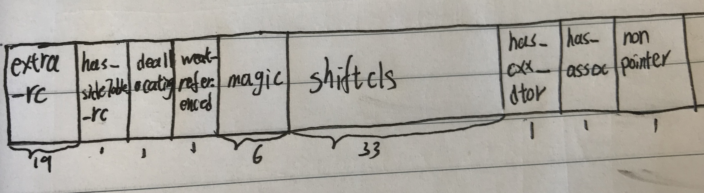
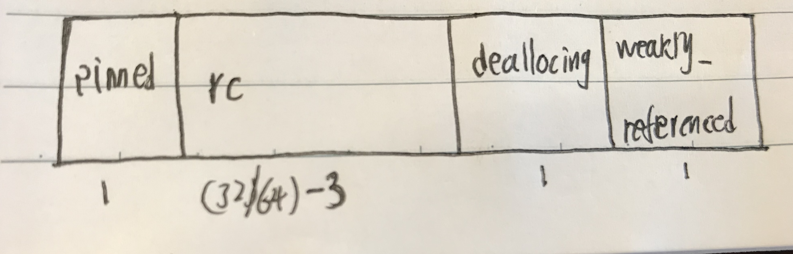

## 引用计数机制简述
我们知道，程序运行过程中要占用内存资源，同时手机资源有限，为了保证程序能在有限的资源下流畅地运行，就需要对内存进行管理。目前知道的内存管理机制有垃圾回收机制，苹果的引用计数机制。他们都能在内存资源不被使用时废弃回收。这里我们只介绍苹果的引用计数机制。

### 引用计数机制的原理
苹果采用`引用计数机制`区分资源是否还再被使用，来控制资源废弃的时机
* `retainCount`表示资源正在被使用的地方的个数，记得是一个次数；其值为0表示没有任何地方使用，就应该废弃并回收资源；其值>0表示资源还在被使用不应该废弃。
* 每有一地方要使用资源`retainCount`就+1，每有一地方不再使用资源`retainCount`就-1。
* 资源都是因为需要而分配创建的，所以资源创建的同时`retainCount`值置为1。

解释几个操作对象的名词：
* 生成：执行alloc、new、copy、mutableCopy等构造方法，开辟新的内存资源，生成对象。
* 持有：执行retain方法，增加一次内存空间被使用的次数
* 释放：执行release方法，减少一次内存空间被使用的次数
* 废弃：执行dealloc方法，使资源不能在被使用

苹果的内存管理经历了MRC和ARC，他们最大的区别就是内存管理交由谁来管理；MRC时代内存需要程序员自己管理，自己在合适的贷方添加retain、release等操作；ARC时代程序员不再花费大部分经历管理内存，交由编译器自动管理,程序员只需告诉编译器对象之间的引用关系即可。


### ARC的规则
* 不能手动发送retain、release、autoRelease、retainCount、dealloc消息，编译器会帮我们自动插入这些代码；可以实现dealloc方法，实现时不用在调super，会自动调用
* OC中不能使用NSZone、NSAllocateObject和NSDeallocateObject
* ARC只适用于OC对象，对于C、coreFoundation对像和指针还需我们自己手动管理
* ARC使内存延迟释放，可以使用自动释放池代码块，来加快释放。关于autoreleasepool可以看[这篇]()文章。

### 循环引用问题
出现循环应用的场景：当A使用了B，B里的处理逻辑也使用A，导致二者互相持有，互相等待被释放，最后retainCount都不会减为0，内存资源就不会被释放回收。<br/>
为了解决这个问题，引入了`弱引用`的概念。`弱引用`不会让`retainCount`值+1。A强引用B，B弱引用A，当除了B以外的其他地方都不使用A是，A的retainCount值就会为0，打破了相互等待的状态，这样AB就可以释放回收了。<br/>
无论是MRC还是ARC时代都会出现这个问题。MRC下需程序员找到打破循环引用环的点添加release即可，但是在ARC下编译器不会自动打破，这个时候就要用到weak或者assign来告诉编译器在哪里打破环。<br/>
这个是最容易发生错误的地方，尤其是在block、NSTimer时注意。

### 野指针问题
因为弱引用的引入，如果A被释放了，B还再被其他地方使用，当B在处理逻辑时需要访问A的值时，因为A已经被释放了，这就会出现野指针。
为了解决这个问题，苹果内部引入了`weak_table_t`和`weak_entry_t`的内部实现逻辑，保存弱引用指针和引用对象之间的关系，当对象被释放时，自动将弱引用该对象的指针置为nil。这个过程是runtime自动实现的，我们在编码过程中也无需考虑。详细介绍看[这里](weak原理浅析.md)


## ARC基础数据结构
### tagged pointer
在runtime的源码中我们总能看到，`isTaggedPointer`的判断。简单来说`TaggedPointer`是决定内存地址结构的一个标记位。<br/>
CPU的长度决定了数据类型的长度。在64位系统下，基本数据类型使用4个字节就能存储很大的数组，如果使用64个字节存储一个数值，就浪费空间。因此苹果引入了Tagger Point的概念：将对象指针分成两部分，一部分用于存储数据值，另一部分标记这个指针的特殊性。这样指针的值不再是指向另一块内存的地址，而是真正存储的值。最终在这个宏中赋值
```objectivec
#if (TARGET_OS_OSX || TARGET_OS_IOSMAC) && __x86_64__
    // 64-bit Mac - tag bit is LSB
#   define OBJC_MSB_TAGGED_POINTERS 0
#else
    // Everything else - tag bit is MSB
#   define OBJC_MSB_TAGGED_POINTERS 1
#endif
```

* taggedPointer用于存储小对象，如NSDate、NSNumber
* taggedpointer的值不再指向另一块内存空间，而存储真正的值
* 读取速度就快很多

### isa并不总直接指向metaClass和class
在[Runtime浅析](Runtime简述.md#objc_object)中已经介绍了，`isa_t`的结构的原理，知道isa_t是一个联合体，当使用nonpointer时isa_t不只存储Class，还有其他信息。这里我们仔细看看获取对象class方法的实现:NSObject的calss->object_getClass->objc_object::getIsa()->
```objectivec
inline Class 
objc_object::getIsa() 
{
    //没有使用TaggedPointer
    if (!isTaggedPointer()) return ISA();

    //使用TaggedPointer
    uintptr_t ptr = (uintptr_t)this;
    if (isExtTaggedPointer()) {
        uintptr_t slot = 
            (ptr >> _OBJC_TAG_EXT_SLOT_SHIFT) & _OBJC_TAG_EXT_SLOT_MASK;
        return objc_tag_ext_classes[slot];
    } else {
        uintptr_t slot = 
            (ptr >> _OBJC_TAG_SLOT_SHIFT) & _OBJC_TAG_SLOT_MASK;
        return objc_tag_classes[slot];
    }
}

inline Class 
objc_object::ISA() 
{
    assert(!isTaggedPointer()); 
#if SUPPORT_INDEXED_ISA
    if (isa.nonpointer) {
        uintptr_t slot = isa.indexcls;
        return classForIndex((unsigned)slot);
    }
    return (Class)isa.bits;
#else
    return (Class)(isa.bits & ISA_MASK);
#endif
}
```
使用`TaggedPointer`时，直接用地址按位相与找到类的编号进而取得类名，这证印证我们上面说到的内容。<br/>
`ISA()`方法中直接使用bits按位相与取得。可以看出isa_t存储信息除了class还有更多内容。arm64架构下的`isa_t`的结构如图：


### RefcountMap中的size_t
在[weak原理浅析](weak原理浅析.md#weak的数据结构)中已经介绍了，存储retainCount的地方在sideTable中的`RefcountMap`。
```objectivec
typedef objc::DenseMap<DisguisedPtr<objc_object>,size_t,true> RefcountMap;

class DenseMapBase {
protected:
  typedef std::pair<KeyT, ValueT> BucketT;

public:
  ...
  typedef DenseMapIterator<KeyT, ValueT, KeyInfoT> iterator;
  typedef DenseMapIterator<KeyT, ValueT,
                           KeyInfoT, true> const_iterator;
  inline iterator begin() {
    return empty() ? end() : iterator(getBuckets(), getBucketsEnd());
  }
  inline iterator end() {
    return iterator(getBucketsEnd(), getBucketsEnd(), true);
  }
  .....
};
```
`RefcountMap`就是`DenseMap`,`DenseMap`继承自`DenseMapBase`。通过源码我们看到`DenseMapBase`是一个范型字典，还有内置的迭代器。以`DisguisedPtr<objc_object>`为key，以`size_t`为value。前面文章中也说过`DisguisedPtr<objc_object>`就是实例地址的变形，可以理解成就是实例地址。同时这个字典也重载了`[]`，可以快速通过对象地址找到对应的`size_t`；`size_t`定义如下：
```objectivec
// The order of these bits is important.
#define SIDE_TABLE_WEAKLY_REFERENCED (1UL<<0)
#define SIDE_TABLE_DEALLOCATING      (1UL<<1)  // MSB-ward of weak bit
#define SIDE_TABLE_RC_ONE            (1UL<<2)  // MSB-ward of deallocating bit
#define SIDE_TABLE_RC_PINNED         (1UL<<(WORD_BITS-1))
```

`size_t`的长度跟cpu长度相同，可能32为也可能是64为，中间存储实例的retainCount值。
如果实例开启了nonpointer，retainCount = extra_rc + sideTableRC + 1;如果没有开启nonpinter，retainCount = extra_rc + 1;

## 引用计数值的改变
基于上面内容，我们来看看retain、release、retainCount、dealloc的实现细节
### retain
```objectivec
inline id 
objc_object::retain()
{
    //前面说过taogedPointer类型的值直接保存在地址中，没有存储在堆上
    assert(!isTaggedPointer());

    if (fastpath(!ISA()->hasCustomRR())) {
        return rootRetain();
    }
    
    //如果实现了retain方法，这个一般在MRC下会调用到
    return ((id(*)(objc_object *, SEL))objc_msgSend)(this, SEL_retain);
}

ALWAYS_INLINE id 
objc_object::rootRetain(bool tryRetain, bool handleOverflow)
{
    if (isTaggedPointer()) return (id)this;

    bool sideTableLocked = false;
    bool transcribeToSideTable = false;

    isa_t oldisa;
    isa_t newisa;

    do {
        transcribeToSideTable = false;
        oldisa = LoadExclusive(&isa.bits);
        newisa = oldisa;
        //没有开启nonpointer，直接在sideTable中加1
        if (slowpath(!newisa.nonpointer)) {
            ClearExclusive(&isa.bits);
            if (!tryRetain && sideTableLocked) sidetable_unlock();
            if (tryRetain) return sidetable_tryRetain() ? (id)this : nil;
            else return sidetable_retain();
        }
        //正在dealocating不作处理
        if (slowpath(tryRetain && newisa.deallocating)) {
            ClearExclusive(&isa.bits);
            if (!tryRetain && sideTableLocked) sidetable_unlock();
            return nil;
        }
        
        //开启nonpointer，首先尝试在isa_t上加1，
        uintptr_t carry;
        newisa.bits = addc(newisa.bits, RC_ONE, 0, &carry);  // extra_rc++
        //在isa_t添加时移除，说明已经满了，需要在sideTable上添加
        if (slowpath(carry)) {
            // newisa.extra_rc++ overflowed
            if (!handleOverflow) {
                ClearExclusive(&isa.bits);
                return rootRetain_overflow(tryRetain);
            }
            // Leave half of the retain counts inline and 
            // prepare to copy the other half to the side table.
            if (!tryRetain && !sideTableLocked) sidetable_lock();
            sideTableLocked = true;
            transcribeToSideTable = true;
            newisa.extra_rc = RC_HALF;
            newisa.has_sidetable_rc = true;
        }
    } while (slowpath(!StoreExclusive(&isa.bits, oldisa.bits, newisa.bits)));
    //在sideTable上加1，可能是没有开启nonpinter，或者开启但isa_t已满
    if (slowpath(transcribeToSideTable)) {
        // Copy the other half of the retain counts to the side table.
        sidetable_addExtraRC_nolock(RC_HALF);
    }

    if (slowpath(!tryRetain && sideTableLocked)) sidetable_unlock();
    return (id)this;
}
//在sidetable中retainCount加1
id
objc_object::sidetable_retain()
{
#if SUPPORT_NONPOINTER_ISA
    assert(!isa.nonpointer);
#endif
    SideTable& table = SideTables()[this];
    
    table.lock();
    size_t& refcntStorage = table.refcnts[this];
    if (! (refcntStorage & SIDE_TABLE_RC_PINNED)) {
        refcntStorage += SIDE_TABLE_RC_ONE;
    }
    table.unlock();

    return (id)this;
}

bool 
objc_object::sidetable_addExtraRC_nolock(size_t delta_rc)
{
    assert(isa.nonpointer);
    SideTable& table = SideTables()[this];

    size_t& refcntStorage = table.refcnts[this];
    size_t oldRefcnt = refcntStorage;
    // isa-side bits should not be set here
    assert((oldRefcnt & SIDE_TABLE_DEALLOCATING) == 0);
    assert((oldRefcnt & SIDE_TABLE_WEAKLY_REFERENCED) == 0);
    
    //size_t已满，返回失败
    if (oldRefcnt & SIDE_TABLE_RC_PINNED) return true;

    uintptr_t carry;
    size_t newRefcnt = 
        addc(oldRefcnt, delta_rc << SIDE_TABLE_RC_SHIFT, 0, &carry);
    //添加之后满了，标记已满并返回失败
    if (carry) {
        refcntStorage =
            SIDE_TABLE_RC_PINNED | (oldRefcnt & SIDE_TABLE_FLAG_MASK);
        return true;
    }
    else {
    //存储加1之后的值，返回成功
        refcntStorage = newRefcnt;
        return false;
    }
}

```
`retian`中判断在arc时会调用到`rootRetain`。进一步再判断taggpointer和nonpointer。开启nonpinter时先尝试在isa_t中加1，加完如果满了就再sidetable中加1，否则就存储新值并结束；没有开启nonpointer时直接在sidetable中添加。在stripedMap中找到sidetable，再使用sidetable的find方法找到size_t，没找到就新加一个size_t;size_t中判断是否已满，满了就结束，不满就添加，添加之后要根据新值判断是否已满更新标记位，然后存新值结束。<br/>

### release
```objectivec
ALWAYS_INLINE bool 
objc_object::rootRelease(bool performDealloc, bool handleUnderflow)
{
    if (isTaggedPointer()) return false;

    bool sideTableLocked = false;

    isa_t oldisa;
    isa_t newisa;

 retry:
    do {
        oldisa = LoadExclusive(&isa.bits);
        newisa = oldisa;
        if (slowpath(!newisa.nonpointer)) {
            ClearExclusive(&isa.bits);
            if (sideTableLocked) sidetable_unlock();
            return sidetable_release(performDealloc);
        }
        // don't check newisa.fast_rr; we already called any RR overrides
        uintptr_t carry;
        newisa.bits = subc(newisa.bits, RC_ONE, 0, &carry);  // extra_rc--
        //extra_rc没有值之后，从sidetable中copy过来，
        if (slowpath(carry)) {
            // don't ClearExclusive()
            goto underflow;
        }
    } while (slowpath(!StoreReleaseExclusive(&isa.bits, 
                                             oldisa.bits, newisa.bits)));//减1之后存储新值

    if (slowpath(sideTableLocked)) sidetable_unlock();
    return false;

 underflow:
    // newisa.extra_rc-- underflowed: borrow from side table or deallocate
    // abandon newisa to undo the decrement
    //把sidetable中值挪动到isa_t中
    
    newisa = oldisa;
    if (slowpath(newisa.has_sidetable_rc)) {
        if (!handleUnderflow) {
            ClearExclusive(&isa.bits);
            return rootRelease_underflow(performDealloc);
        }

        // Try to remove some retain counts from the side table.   
        
        size_t borrowed = sidetable_subExtraRC_nolock(RC_HALF);
        if (borrowed > 0) {
            // Side table retain count decreased.
            // Try to add them to the inline count.
            newisa.extra_rc = borrowed - 1;  // redo the original decrement too
            bool stored = StoreReleaseExclusive(&isa.bits, 
                                                oldisa.bits, newisa.bits);
                                             
            //存储新值
            ....
            sidetable_unlock();
            return false;
        }
        else {
            //sidetable 的retainCount为0
            // Side table is empty after all. Fall-through to the dealloc path.
        }
    }

    // Really deallocate.

    if (slowpath(newisa.deallocating)) {
        ClearExclusive(&isa.bits);
        if (sideTableLocked) sidetable_unlock();
        return overrelease_error();
        // does not actually return
    }
    newisa.deallocating = true;
    if (!StoreExclusive(&isa.bits, oldisa.bits, newisa.bits)) goto retry;

    if (slowpath(sideTableLocked)) sidetable_unlock();

    //同步实例的状态，并准备进行dealloc
    __sync_synchronize();
    if (performDealloc) {
        ((void(*)(objc_object *, SEL))objc_msgSend)(this, SEL_dealloc);
    }
    return true;
}

```
这里判断逻辑和retain一样，由于retainCount的值存储在两个地方，规定优先减isa_t中的extra_rc值，减为0之后把sidetable中的值挪到isa_t中，每次挪动的值<=isa_t能存储的最大值，同时sidetable中的值减去相应的数保证总数不变。<br/>
仔细看判断条件，减1之后溢出且sidetable中没有值时才会把`deallocating`标记位置为YES，也就是说当两部分之和为0时不会释放资源，要等到下一次执行release时才释放资源。<br/>
更新deallocating状态时还执行了`__sync_synchronize();`,猜测这里应该是把实例的状态同步到一个地方，等待runloop的自动释放池销毁时执行dealloc方法。当再次访问这个实例时报野指针的错误。

### retainCount
```objectivec
inline uintptr_t 
objc_object::rootRetainCount()
{
    if (isTaggedPointer()) return (uintptr_t)this;

    sidetable_lock();
    isa_t bits = LoadExclusive(&isa.bits);
    ClearExclusive(&isa.bits);
    if (bits.nonpointer) {
        uintptr_t rc = 1 + bits.extra_rc;
        if (bits.has_sidetable_rc) {
            rc += sidetable_getExtraRC_nolock();
        }
        sidetable_unlock();
        return rc;
    }

    sidetable_unlock();
    return sidetable_retainCount();
}

size_t 
objc_object::sidetable_getExtraRC_nolock()
{
    assert(isa.nonpointer);
    SideTable& table = SideTables()[this];
    RefcountMap::iterator it = table.refcnts.find(this);
    if (it == table.refcnts.end()) return 0;
    else return it->second >> SIDE_TABLE_RC_SHIFT;
}
```
明显这个实现就是我们上面说到的，retainCount = extra_rc + sideTableRC + 1；
这里返回的值会始终大于等于1，结合release就会明白。
在创建实例的时候，必然会有一个指针变量接收实例，这个时候其实变量是持有对象的，但是这个时候没有执行retain方法，retainCount却返回了1，内存中存储的是真实计数0；实例再次被其他地方持有时会调用retain方法；相应地，其他地方不再持有实例时会执行release方法，当然最开始接收对象的指针在释放时也会执行release方法，这就保证在内存中存储值为0后再次执行release时才会释放对象。
```objectivec
self.obj = [[NSObject alloc]init];
//等价于
NSObject *objjjj = [[NSObject alloc]init];
self.obj = objjjj;
```
创建实例时，内存存储的retainCount是0，retainCount返回了1，我们可以理解成：objjj这个指针指向了实例，objjj持有实例；<br/>
给self.obj赋值时执行了一次retain操作，内存存储的是1，retainCount返回2<br/>
当此代码块执行完毕后objjj会被释放执行一次release操作，内存存储0，retainCount返回1<br/>
当self.obj再被置nil时执行release操作，因为内存中已经是0，这个时候就要释放资源了<br/>
我们可以简单理解成，计算机系统下的数都是从0开始计数，真实世界中数从1开始计数，计算机中的0=真实世界的1。retainCount中返回值加1是为了便于理解。


### dealloc
```objectivec
id 
object_dispose(id obj)
{
    if (!obj) return nil;

    objc_destructInstance(obj);    
    free(obj);//释放ivar等资源

    return nil;
}

void *objc_destructInstance(id obj) 
{
    if (obj) {
        // Read all of the flags at once for performance.
        bool cxx = obj->hasCxxDtor();
        bool assoc = obj->hasAssociatedObjects();

        // This order is important.
        if (cxx) object_cxxDestruct(obj);//自定义析构函数
        if (assoc) _object_remove_assocations(obj);//移除关联对象
        obj->clearDeallocating();//会调用到sidetable_clearDeallocating，清空sidetable中的weak和retainCount资源
    }

    return obj;
}

void 
objc_object::sidetable_clearDeallocating()
{
    SideTable& table = SideTables()[this];
    table.lock();
    RefcountMap::iterator it = table.refcnts.find(this);
    if (it != table.refcnts.end()) {
        if (it->second & SIDE_TABLE_WEAKLY_REFERENCED) {
            //清空weak_entry_t，并释放资源
            weak_clear_no_lock(&table.weak_table, (id)this);
        }
        //释放存储retainCount的size_t资源
        table.refcnts.erase(it);
    }
    table.unlock();
}
```
dealloc执行顺序
1. 执行自定义析构函数
2. 释放关联对象,关联对象也遵循ARC规则，可以看详细说明。这里一并移除父类和子类的关联对象
3. 弱引用指针置为nil，并移除weak_entry_t并释放相应空间
4. 释放RefcountMap中的对应的实例键值对并释放相应空间
5. 释放实例对象内存空间，根据实例地址、offset和ivar的引用关系做释放release或其他操作，这里一并移除父类和子类的ivar。


