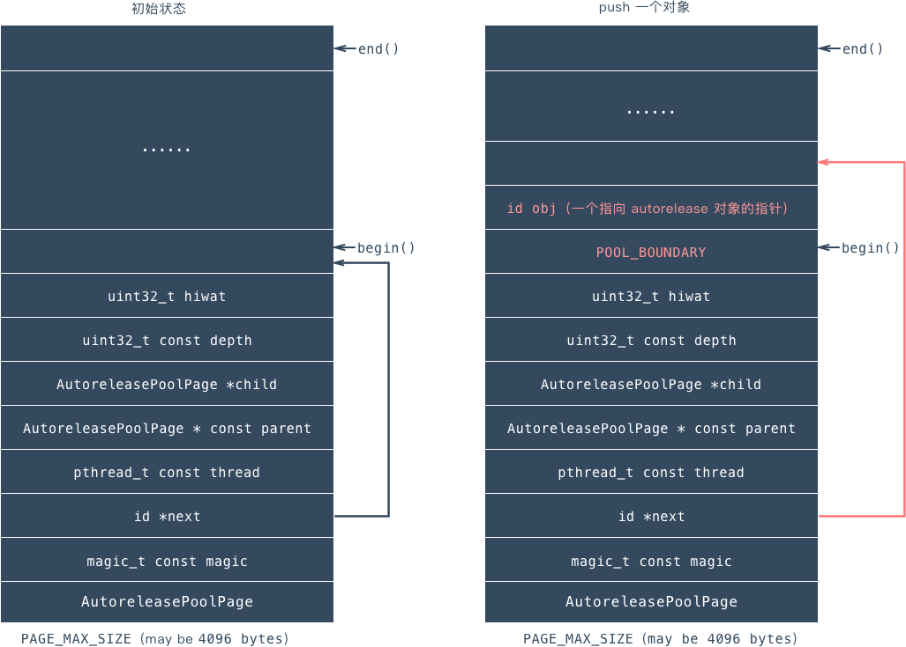

## 引入原因
普通函数方法中的临时变量的生命范围是方法的左右括号之间，cocoa框架下内存管理使用的是引用计数方法，创建临时对象时retainCount为1，在方法结束前临时对象会被release一次，
retainCount为0，这样内存就会被废弃，不能在被访问了，这样就会导致在一些需要返回对象的方法中，永远收不到任何返回值。所以就引入了AutoReleasePool，延迟对象的释放。
这里要强调一点：xcode编译器认为以alloc、new、copy、mutableCopy开头的方法是构造方法，构造方法的返回值时存在的，所以不必放入释放池里。

## 原理
通过使用`clang -rewrite-objc main.m`发现自动释放池就在开始和结束分别执行了aotoreleasepool的push和pop方法。这里涉及到AutoreleasePoolPage、_objc_autoreleasePoolPush和
_objc_autoreleasePoolPop。

### AutoreleasePoolPage
其结构如图所示：（这里只写了部分属性）

* `magic` 用来校验 AutoreleasePoolPage 的结构是否完整;
* `next` 指向最新添加的 autoreleased 对象的下一个位置，初始化时指向 begin();
* `thread` 指向当前线程;
* `parent` 指向父结点，第一个结点的 parent 值为 nil;
* `child` 指向子结点，最后一个结点的 child 值为 nil;
* `depth` 代表pool的嵌套级别，从 0 开始，往后递增 1; depth相同代表同级并列池子，不同代表嵌套池子。
* `AutoreleasePool`实质就是一个指针栈stack。
* page里存储指针指向是一个以后会release的对象，或者pool边界的哨兵位POOL_BOUNDARY。

#### 双向链表
自动释放池是一个双向链表的数据结构，`AutoreleasePoolPage`是这个双向链表的节点结构，双向链表的parent指针指向上一个节点，child指针指向下一个节点，这样一个个节点就连接起来。
```objectivec
AutoreleasePoolPage(AutoreleasePoolPage *newParent) 
        : magic(), next(begin()), thread(pthread_self()),
          parent(newParent), child(nil), 
          depth(parent ? 1+parent->depth : 0), 
          hiwat(parent ? parent->hiwat : 0)
    { 
        if (parent) {
            parent->check();
            assert(!parent->child);
            parent->unprotect();
            parent->child = this;
            parent->protect();
        }
        protect();
    }
```
在新的节点创建的时候，传入上一个节点地址，在构造函数中决定新节点的parent指针指向和parent节点的child指针指向。

#### page的固定长度
```objectivec
static void * operator new(size_t size) {
        return malloc_zone_memalign(malloc_default_zone(), SIZE, SIZE);
}
#define I386_PGBYTES		4096		
```
`AutoreleasePoolPage`会被创建成一个固定4096(16的3次方)字节的对象。换算成16进制就是0x1000

#### begin()和end()
`AutoreleasePoolPage`结构体分为两部分，一部分存储节点的成员变量：next指针、parent&child指针、depth等；另一部分存储加入池子中的对象。
比如page创建地地址是0x0001到0x1000，低位部分存储成员变量的值，高位部分存储加入池子的对象。通过begin()找到当前page中第一个加入的对象地址，end()找到最后一个对象。
```objectivec
id * begin() {
    return (id *) ((uint8_t *)this+sizeof(*this));
}

id * end() {
    return (id *) ((uint8_t *)this+SIZE);
}
```
一图胜百字，我们直接看图


#### POOL_BOUNDARY池子边界
上面我看知道AutoreleasePoolPage的大小是固定的，每个page里存储的对象地址个数也是固定的，但是我们在编写程序的时在每个autoreleasePool里存放的对象个数是不确定的，runtime是哦怎么解决这个问题的呢？
通过引入POOL_BOUNDARY标记池子的边界，即两个POOL_BOUNDARY之间的对象在一个pool里。pool token就是池子开始的位置，即低地址POOL_BOUNDARY的位置。如图所示：


#### hotPage
pool中最新操作的链表节点为hotPage，hotPage可以是一个，也可以是多个。尤其是在pop的时候，hotpage是池子里的所有page，即两个POOL_BOUNDARY之间的page。

#### TLS
TLS(Thread Local Storage)的作用是能将数据和执行的特定的线程联系起来。
每一个线程都有属于自己线程一个独立的DWORD数据，这个数据区通过key-value的形式存储数据。在tsd_private.h文件中设置了好多key
```objectivec
/* Keys 40-49 for Objective-C runtime usage */
#define __PTK_FRAMEWORK_OBJC_KEY0	40
#define __PTK_FRAMEWORK_OBJC_KEY1	41
#define __PTK_FRAMEWORK_OBJC_KEY2	42
#define __PTK_FRAMEWORK_OBJC_KEY3	43
#define __PTK_FRAMEWORK_OBJC_KEY4	44
#define __PTK_FRAMEWORK_OBJC_KEY5	45
#define __PTK_FRAMEWORK_OBJC_KEY6	46
#define __PTK_FRAMEWORK_OBJC_KEY7	47
#define __PTK_FRAMEWORK_OBJC_KEY8	48
#define __PTK_FRAMEWORK_OBJC_KEY9	49
```
这个`__PTK_FRAMEWORK_OBJC_KEY3`就是用来标记当前线程的hotPage。
每一个线程有自己单独的autoreleasePage链表。每个链表都有自己的hotPage。


### _objc_autoreleasePoolPush
### _objc_autoreleasePoolPop


## 特点总结
```objectivec

```
