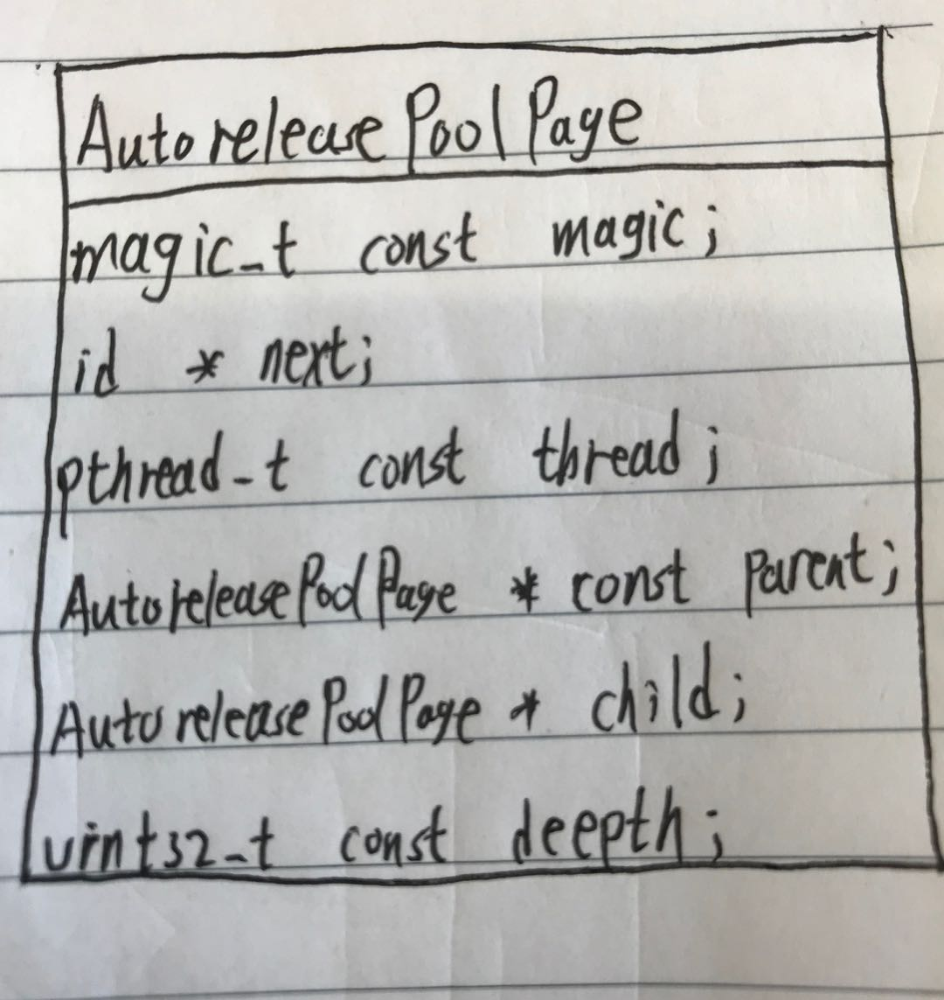
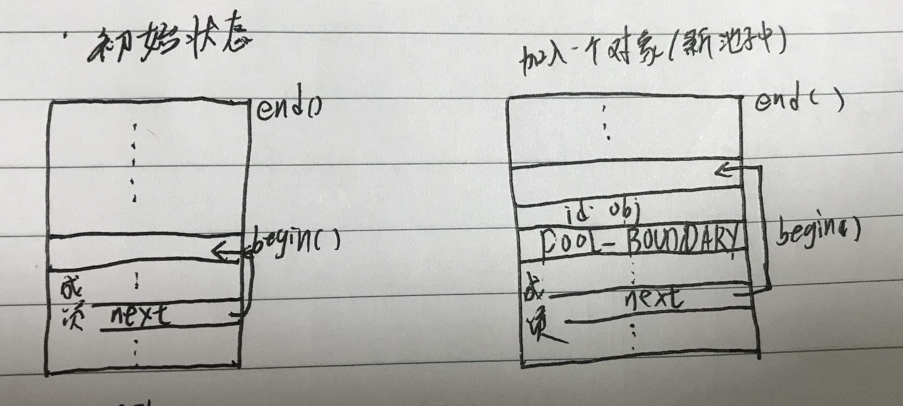
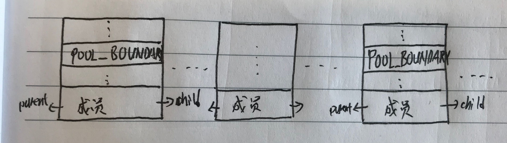

## 引入原因
普通函数方法中的临时变量的生命范围是方法的左右括号之间，cocoa框架下内存管理使用的是引用计数方法，创建临时对象时retainCount为1，在方法结束前临时对象会被release一次，
retainCount为0，这样内存就会被废弃，不能在被访问了，这样就会导致在一些需要返回对象的方法中，永远收不到任何返回值。所以就引入了AutoReleasePool，延迟对象的释放。
这里要强调一点：xcode编译器认为以alloc、new、copy、mutableCopy开头的方法是构造方法，构造方法的返回值是存在的，所以不必放入释放池。

## 原理
通过使用`clang -rewrite-objc main.m`发现自动释放池就在开始和结束分别执行了aotoreleasepool的push和pop方法。这里涉及到AutoreleasePoolPage、_objc_autoreleasePoolPush和
_objc_autoreleasePoolPop。

### AutoreleasePoolPage
其结构如图所示：（这里只写了部分属性）

* `magic` 用来校验 AutoreleasePoolPage 的结构是否完整;
* `next` 指向最新添加的 autoreleased 对象的下一个位置，初始化时指向 begin();
* `thread` 指向当前线程;
* `parent` 指向父结点，第一个结点的 parent 值为 nil;
* `child` 指向子结点，最后一个结点的 child 值为 nil;
* `depth` 代表pool的嵌套级别，从 0 开始，往后递增 1; depth相同代表同级并列池子，不同代表嵌套池子。
* `AutoreleasePool`实质就是一个指针栈stack。
* page里存储指针指向是一个以后会release的对象，或者pool边界的哨兵位POOL_BOUNDARY。

#### 双向链表
自动释放池是一个双向链表的数据结构，`AutoreleasePoolPage`是这个双向链表的节点结构，双向链表的parent指针指向上一个节点，child指针指向下一个节点，这样一个个节点就连接起来。
```objectivec
AutoreleasePoolPage(AutoreleasePoolPage *newParent) 
        : magic(), next(begin()), thread(pthread_self()),
          parent(newParent), child(nil), 
          depth(parent ? 1+parent->depth : 0), 
          hiwat(parent ? parent->hiwat : 0)
    { 
        if (parent) {
            parent->check();
            assert(!parent->child);
            parent->unprotect();
            parent->child = this;
            parent->protect();
        }
        protect();
    }
```
在新的节点创建的时候，传入上一个节点地址，在构造函数中决定新节点的parent指针指向和parent节点的child指针指向。

#### page的固定长度
```objectivec
static void * operator new(size_t size) {
        return malloc_zone_memalign(malloc_default_zone(), SIZE, SIZE);
}
#define I386_PGBYTES		4096		
```
`AutoreleasePoolPage`会被创建成一个固定4096(16的3次方)字节的对象。换算成16进制就是0x1000

#### begin()和end()
`AutoreleasePoolPage`结构体分为两部分，一部分存储节点的成员变量：next指针、parent&child指针、depth等；另一部分存储加入池子中的对象。
比如page创建地地址是0x0001到0x1000，低位部分存储成员变量的值，高位部分存储加入池子的对象。通过begin()找到当前page中第一个加入的对象地址，end()找到最后一个对象。
```objectivec
id * begin() {
    return (id *) ((uint8_t *)this+sizeof(*this));
}

id * end() {
    return (id *) ((uint8_t *)this+SIZE);
}
```
一图胜百字，我们直接看图


#### POOL_BOUNDARY池子边界
```objectivec
#   define POOL_BOUNDARY nil
```
上面我看知道AutoreleasePoolPage的大小是固定的，每个page里存储的对象地址个数也是固定的，但是我们在编写程序的时在每个autoreleasePool里存放的对象个数是不确定的，runtime是怎么解决这个问题的呢？
通过引入POOL_BOUNDARY标记池子的边界，即两个POOL_BOUNDARY之间的对象在一个pool里。pool token就是池子开始的位置，即低地址POOL_BOUNDARY的位置。如图所示：


#### EMPTY_POOL_PLACEHOLDER--空池子
```objectivec
#   define EMPTY_POOL_PLACEHOLDER ((id*)1)
```
表示当前线程创建了一个池子但池子里没有任何对象，即空池子。注意与POOL_BOUNDARY的区别

#### hotPage
pool中最新操作的链表节点为hotPage，hotPage可以是一个，也可以是多个。尤其是在pop的时候，hotpage是池子里的所有page，即两个POOL_BOUNDARY之间的page。

#### TLS
TLS(Thread Local Storage)的作用是能将数据和执行的特定的线程联系起来。
每一个线程都有属于自己线程一个独立的DWORD数据，这个数据区通过key-value的形式存储数据。在tsd_private.h文件中设置了好多key
```objectivec
/* Keys 40-49 for Objective-C runtime usage */
#define __PTK_FRAMEWORK_OBJC_KEY0	40
#define __PTK_FRAMEWORK_OBJC_KEY1	41
#define __PTK_FRAMEWORK_OBJC_KEY2	42
#define __PTK_FRAMEWORK_OBJC_KEY3	43
#define __PTK_FRAMEWORK_OBJC_KEY4	44
#define __PTK_FRAMEWORK_OBJC_KEY5	45
#define __PTK_FRAMEWORK_OBJC_KEY6	46
#define __PTK_FRAMEWORK_OBJC_KEY7	47
#define __PTK_FRAMEWORK_OBJC_KEY8	48
#define __PTK_FRAMEWORK_OBJC_KEY9	49
```
这个`__PTK_FRAMEWORK_OBJC_KEY3`就是用来标记当前线程的hotPage。
每一个线程有自己单独的autoreleasePage链表。每个链表都有自己的hotPage。


### _objc_autoreleasePoolPush
```objectivec
    static inline void *push() 
    {
        id *dest;
        if (DebugPoolAllocation) {
            // Each autorelease pool starts on a new pool page.
            dest = autoreleaseNewPage(POOL_BOUNDARY);
        } else {
            dest = autoreleaseFast(POOL_BOUNDARY);
        }
        assert(dest == EMPTY_POOL_PLACEHOLDER || *dest == POOL_BOUNDARY);
        return dest;
    }

    static inline id *autoreleaseFast(id obj)
    {
        AutoreleasePoolPage *page = hotPage();
        //1当前线程存在hotpage且page还没满
        if (page && !page->full()) {
            return page->add(obj);//添加POOL_BOUNDARY边界，池子哨兵位
        } else if (page) {
        //2当前线程存在hotpage，但page已满
            return autoreleaseFullPage(obj, page);//找到page节点后面一个不满的page，然后插入到这个page上，如果都满了就add一个page
        } else {
        //3当前线程没有hotPage,这里有两种情况：i没有任何pool，ii有一个空的池子
            return autoreleaseNoPage(obj);
        }
    }
    
    static inline AutoreleasePoolPage *hotPage() 
    {
        AutoreleasePoolPage *result = (AutoreleasePoolPage *)
            tls_get_direct(key);
        //EMPTY_POOL_PLACEHOLDER表示当前线程还没有创建过pool
        if ((id *)result == EMPTY_POOL_PLACEHOLDER) return nil;
        if (result) result->fastcheck();
        return result;
    }
```
不考虑debug环境时_objc_autoreleasePoolPush最终会调用到AutoreleasePoolPage中静态方法autoreleaseFast(id obj)。首先获取hotPage，有就返回，没有就返回nil。这里处理三种不同情况。我们先看第一种情况：有hotpage且不满，直接在hotpage中add。
```objectivec
    id *add(id obj)
    {
        assert(!full());
        unprotect();
        id *ret = next;  // faster than `return next-1` because of aliasing
        *next++ = obj;   //等价于*next=obj；next++
        protect();
        return ret;
    }
```
实现思路很简单：让next指针指向obj，next指针上移。这里传入的obj时POOL_BOUNDARY(nil),其实就是添加了一个池子边界，代表一个新的池子。<br/>
其次我们看第二种情况：hotpage已满
```objectivec
    static __attribute__((noinline))
    id *autoreleaseFullPage(id obj, AutoreleasePoolPage *page)
    {
        // The hot page is full. 
        // Step to the next non-full page, adding a new page if necessary.
        // Then add the object to that page.
        assert(page == hotPage());
        assert(page->full()  ||  DebugPoolAllocation);

        do {
            if (page->child) page = page->child;
            else page = new AutoreleasePoolPage(page);
        } while (page->full());

        setHotPage(page);
        return page->add(obj);
    }
```
这里传入两个参数，开始查找的page和要加入的对象obj。从hotpage开始往child查找，直到找得到不满的page，然后把obj插入到找到不满的page；如果找到top-level还没没有符合条件的，就在top-level后创建新的page，在这个新爬个中插入obj。最后更新hotpage<br/>
最后看第三种情况：创建一个池子
```objectivec
    static __attribute__((noinline))
    id *autoreleaseNoPage(id obj)
    {
        // "No page" could mean no pool has been pushed
        // or an empty placeholder pool has been pushed and has no contents yet
        assert(!hotPage());

        bool pushExtraBoundary = false;
        if (haveEmptyPoolPlaceholder()) {
            // We are pushing a second pool over the empty placeholder pool
            // or pushing the first object into the empty placeholder pool.
            // Before doing that, push a pool boundary on behalf of the pool 
            // that is currently represented by the empty placeholder.
            pushExtraBoundary = true;
        }
        else if (obj != POOL_BOUNDARY  &&  DebugMissingPools) {
            // We are pushing an object with no pool in place, 
            // and no-pool debugging was requested by environment.
            _objc_inform("MISSING POOLS: (%p) Object %p of class %s "
                         "autoreleased with no pool in place - "
                         "just leaking - break on "
                         "objc_autoreleaseNoPool() to debug", 
                         pthread_self(), (void*)obj, object_getClassName(obj));
            objc_autoreleaseNoPool(obj);
            return nil;
        }
        else if (obj == POOL_BOUNDARY  &&  !DebugPoolAllocation) {
            // We are pushing a pool with no pool in place,
            // and alloc-per-pool debugging was not requested.
            // Install and return the empty pool placeholder.
            return setEmptyPoolPlaceholder();
        }

        // We are pushing an object or a non-placeholder'd pool.

        // Install the first page.
        AutoreleasePoolPage *page = new AutoreleasePoolPage(nil);
        setHotPage(page);
        
        // Push a boundary on behalf of the previously-placeholder'd pool.
        if (pushExtraBoundary) {
            page->add(POOL_BOUNDARY);
        }
        
        // Push the requested object or pool.
        return page->add(obj);
    }
```
`haveEmptyPoolPlaceholder()`返回YES表示已经存在池子，只是池子里的还没有添加任何对象；返回NO表示没有个任何一个池子被创建；这标记是否要在page上添加POOL_BOUNDARY的边界。这里可以知道即便在子线程中也会在需要的时候自动创建autoreleasePool，不需要我们手动创建
### _objc_autoreleasePoolPop
`_objc_autoreleasePoolPop`最终会调用到`pop(void *token)`
```objectivec
    static inline void pop(void *token) 
    {
        AutoreleasePoolPage *page;
        id *stop;

        //pop最上层（最外层）的池子，就是pop所有池子
        if (token == (void*)EMPTY_POOL_PLACEHOLDER) {
            // Popping the top-level placeholder pool.
            if (hotPage()) {
                // coldPage()找到最上层的pool，就是找到链头
                pop(coldPage()->begin());
            } else {
                // Pool was never used. Clear the placeholder.
                setHotPage(nil);
            }
            return;
        }

        page = pageForPointer(token);//找到token指针所在的page        
        page->releaseUntil(stop);//从hotpage开始release，直到page的stop位置。
        ...
    }

    void releaseUntil(id *stop) 
    {
        // Not recursive: we don't want to blow out the stack 
        // if a thread accumulates a stupendous amount of garbage
        
        while (this->next != stop) {
            // Restart from hotPage() every time, in case -release 
            // autoreleased more objects
            //每一次循环从hotpage开始
            AutoreleasePoolPage *page = hotPage();

            // fixme I think this `while` can be `if`, but I can't prove it
            //release完一个page后release他的父page
            while (page->empty()) {
                page = page->parent;
                setHotPage(page);
            }

            page->unprotect();
            id obj = *--page->next;
            memset((void*)page->next, SCRIBBLE, sizeof(*page->next));
            page->protect();

            if (obj != POOL_BOUNDARY) {
                objc_release(obj);
            }
        }

        //release到指定的位置后，更新hotPage
        setHotPage(this);
    }
```
### autorelease
我们直到编译器会在代码中合适位置插入`[obj autorelease]`的代码。这个方法最终会待用到`autorelease(id obj)`
```objectivec
    static inline id autorelease(id obj)
    {
        assert(obj);
        assert(!obj->isTaggedPointer());
        id *dest __unused = autoreleaseFast(obj);
        assert(!dest  ||  dest == EMPTY_POOL_PLACEHOLDER  ||  *dest == obj);
        return obj;
    }
```
这个方法最终也会调用到`autoreleaseFast`,和`_objc_autoreleasePoolPush`不同的是,这里传入参数是实例地址而不是nil。

### 返回值的优化
文章开始我们提到，引入autoreleasePool是为了在有返回值的函数中延迟释放返回值内存。通过探究autoreleasePool的实现原理，我们知道使用autoreleasePool的开销比较大，为了让程序更快，苹果爸爸对这个进行了优化，减少加入自动释放池的操作。
```objectivec
//定义Person类，并实现方法shareInstance
@interface Person : NSObject

+ (Person *)shareInstance;

@end

@implementation Person

+ (Person *)shareInstance {
    Person *p = [Person new];
    NSLog(@"%@",p);
    return p;
}

@end

//在viewcontroller的方法里调用person类
- (IBAction)action {
    Person *obj = [Person shareInstance];
    NSLog(@"%@",obj);
}
```
按着我们对autoreleasePool的理解，编译后会自动在插入代码，最终如下：
```objectivec
+ (Person *)shareInstance {
    Person *p = [Person new];
    [p autorelease];//自动插入代码
    NSLog(@"%@",p);
    return p;
}

- (IBAction)action {
    Person *obj = [Person shareInstance];
    [obj autorelease];//自动插入的代码
    NSLog(@"%@",obj);
}
```
我们可以看到person实例从创建到使用经历了两次autorelease，即两次retian和release；一次创建一次使用却要经过两次retain和release，显然是效率低的，所以对返回值进行优化。<br/>
在return前，先调用`objc_retainAutoreleaseReturnValue`。
```objectivec
id 
objc_retainAutoreleaseReturnValue(id obj)
{
    if (prepareOptimizedReturn(ReturnAtPlus0)) return obj;

    return objc_retainAutoreleaseAndReturn(obj);
}
```
objc_retainAutoreleaseReturnValue中有if判断，如果if条件通过就会使用优化机制，否则就正常加入到autoreleasepool中。
```objectivec
static ALWAYS_INLINE bool 
prepareOptimizedReturn(ReturnDisposition disposition)
{
    assert(getReturnDisposition() == ReturnAtPlus0);

    if (callerAcceptsOptimizedReturn(__builtin_return_address(0))) {
        if (disposition) setReturnDisposition(disposition);
        return true;
    }

    return false;
}
```
`__builtin_return_address(0)`获取函数返回地址的层级，就是获取从当前函数调用层级的外面的第0个层级，即函数的调用者的层级。在本代码中，action调用了shareinstance，`__builtin_return_address(0)`的结果就是action方法的层级。
```objectivec
static ALWAYS_INLINE bool 
callerAcceptsOptimizedReturn(const void * const ra0)
{
    const uint8_t *ra1 = (const uint8_t *)ra0;
    const unaligned_uint16_t *ra2;
    const unaligned_uint32_t *ra4 = (const unaligned_uint32_t *)ra1;
    const void **sym;
    
    ...//获取调用函数的实现
    
    sym = (const void **)ra1;
    //判断函数的实现中是否会调用objc_retainAutoreleasedReturnValue 或者objc_unsafeClaimAutoreleasedReturnValue
    if (*sym != objc_retainAutoreleasedReturnValue  &&  
        *sym != objc_unsafeClaimAutoreleasedReturnValue) 
    {
        return false;
    }

    return true;
}
```
如果函数调用者会调用objc_retainAutoreleasedReturnValue或者objc_unsafeClaimAutoreleasedReturnValue；满足条件说明调用方在ARC环境下且支持返回值快速释放机制，然后会根据需要通过`setReturnDisposition`方法，把返回值存储在TLS中。在本demol中就是判断action方法是否在ARC环境下，显然是符合条件的。
```objectivec
static ALWAYS_INLINE void 
setReturnDisposition(ReturnDisposition disposition)
{
    tls_set_direct(RETURN_DISPOSITION_KEY, (void*)(uintptr_t)disposition);
}
```
这样提前判断逻辑是否需要放入autoreleasepool中，进而减少autoreleasePool的开销，同时也加快返回值的释放。本demol中，action希望返回值是个临时变量，所以把shareInstance中创建的person实例存储在TLS中，在action中直接从TLS中取值，这样从person实例创建到最后释放，没有进行retain和release实现了同样逻辑。相比优化前节省了两个retain和release操作，效率大大提高。
下面这个实例代码是会加入到autoreleasePool中
```objectivec
//返回值经过大于一次返回
- (IBAction)action {
    self.obj = [self getObj];
    NSLog(@"%@",self.obj);
}

- (Person *)getObj {
    Person *obj = [Person shareInstance];
    NSLog(@"%@",obj);
    return obj;
}
```
action->getObj->shareInstance,在getObj中要返回shareInstance的返回值，即希望shareInstance的retainCount为1，所以在shareInstance方法中会把person实例加入到autoreleasepool中。这样在action方法中经过几次return也能取到实例的值。
## 特点总结
* 在非构造方法中有返回值且使用引用计数管理内存时，会导致返回值被释放，调用方取不到返回值的问题。苹果使用autoreleasePool来延迟释放对象，来解决此问题。
* AutoreleasePool是一个双向链表指针栈。会使加入到自动释放池的实例retainCount+1，会延迟释放对象。
* push创建一个池子，pop倾倒池子。`@autorelease{`代表push一个池子，`}`代表pop池子。加入池子时给对象发送retian消息，pop池子是给每一个对象发送release消息。
* 当开辟一个新池子时，就向链表hotpage节点加入一个指向为POOL_BOUNDARY(nil)的指针(哨兵位)，作为池子与池子的边界。
* AutoreleasePool的链表是以AUtoreleasePoolPage为节点，节点固定4096bit，地位存储page的成员变量，高位存储加入的实例。
* parent和child指针链接不同的节点构成双向链表；next指针标记page下一次存储位置。
* 通过TLS优化加入与移除操作的开销。尤其是在有返回值的非构造方法中应用。不同的线程中有不同的链表。
* 子线程的pool会在需要的时候自动创建，不需要我们手动创建。
* 含有block快的枚举也自动加入autoreleasePool，来加快一次循环中实例的销毁。for和for-in中没有。
* 同样这个对OC对象才起作用，C对象不起作用。

## 使用场景
* 写基于命令行的代码，即没有UIKit内容
* 写循环，循环里会大量创建临时对象
* 长时间在后台运行的任务
* 创建新的线程且不会自动创建autorelease


