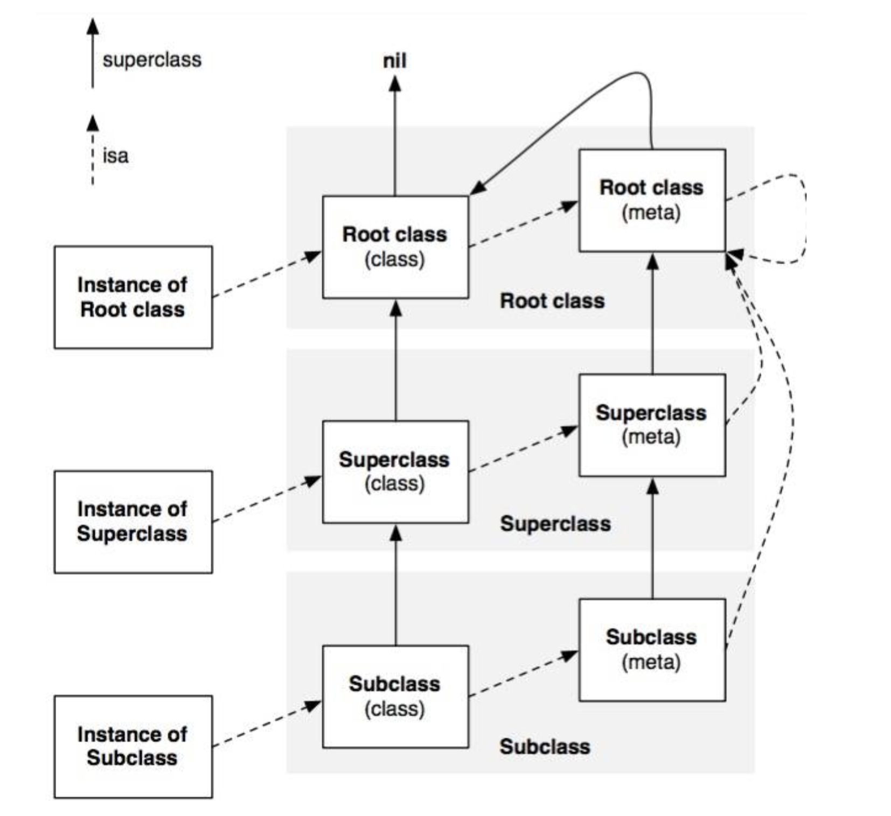

### Runtime概述
OC是面向对象的语言，具有面向对象语言特性：封装（setter和getter，方法、成员变量）、继承、多态<br/>
OC语言有面向对象特性、消息传递机制的特点，而这些都是通过RunTime实现的。<br/>
OC还是一门动态性语言，通过运行时系统(Runtime机制)可以实现动态地创建类和对象、动态添加属性、消息传递和转发等功能。编译的时候决定发送什么样的消息，运行时决定reciver怎样接受这个消息。<br/>
Runtime系统由一系列的函数和数据结构组成。<br/>
利用Runtime的动态性和AOP思想(切片思想Aspect Oriented Programming)可以把琐碎的事务逻辑从主逻辑中分离出来作为单独的模块开发。(比如无埋点，Logging)

### Runtime的调用方式
* 通过OC源代码调用，大多数情况下程序员只编写OC代码，Runtime系统会在幕后辛勤劳动
* NSObject类的方法，NSObject的抽象接口方法,如class、isKindOfClass、description等
* 直接调用Runtime函数，一般不会用到，当在写与其他语言桥接或底层bug工作时用到

### 数据结构
#### objc_object
```objectivec
typedef struct objc_object *id;
```
objc_object代表id类型的实例对象

```objectivec
struct objc_object {
     isa_t isa;
     //一些方法
     ...
}

union isa_t {
     isa_t() {  }
     ...
     Class cls;
     uintptr_t bits;
#if defined(ISA_BITFIELD)
    struct {
        ISA_BITFIELD;  // defined in isa.h
    };
#endif 
}

#   define ISA_BITFIELD                                                      
      uintptr_t nonpointer        : 1; //是否使用nonpointer                                      
      uintptr_t has_assoc         : 1; //是否有关联对象                                     
      uintptr_t has_cxx_dtor      : 1; //是否自定义析构函数                                   
      uintptr_t shiftcls          : 33; /*MACH_VM_MAX_ADDRESS 0x1000000000*/，//calss地址 
      uintptr_t magic             : 6;                                       
      uintptr_t weakly_referenced : 1;  //是否有弱引用指针                                     
      uintptr_t deallocating      : 1;  //是否正在析构                                     
      uintptr_t has_sidetable_rc  : 1;  //在sideTable上是否有引用计数，如果有retainCount=extra_rc+sidetable+1
      uintptr_t extra_rc          : 19  //引用计数，当extra_rc占满之后在sidetable上继续标记
```
`isa_t` 是一个[union联合体](https://blog.csdn.net/engerled/article/details/6205584)，也就是说cls、bits、ISA_BITFIELD结构体共用同一块地址空间,不同时间存储不同的变量<br/>
这里我只贴了在手机64位系统下ISA_BITFIELD结构体的定义。各个含义如代码注释。这里要注意当使用nonPointer时，实例所属的class存储在`shiftcls`位。<br/>
KVO通过修改isa指针实现的，所以我们在判断实例类型是最好使用`-class`方法，而不通过isa指针。

#### objc_class
```objectivec
typedef struct objc_class *Class;
struct objc_class ：objc_object {
     Class superclass;
     cache_t cache;//缓存指针和vtable，加速方法调用
     class_data_bits_t bits; // class_rw_t* 加上flags，存储类实例的方法、属性、协议
     ....
}
```
可以看出OC的类也是一个结构体对象<br/>
`objc_class`继承自`objc_object`,自然也有isa成员变量<br/>
`cache` 缓存当前类已经加载过的方法，是一个bucket_t元素的散列表<br/>
`class_data_bits_t`存储类的实例方法、属性、协议，是`class_rw_t` 加上flags

```objectivec
struct class_rw_t {
    ...
    uint32_t flags;//各种标记位：meta、initializing、initialized、loaded、root等的标记位

    const class_ro_t *ro; //存储编译时确定的属性、方法、协议，即只有主类不包括分类的内容；分类的方法和关联对象存储在class_rw_t中，在运行时生成。

    method_array_t methods;//是method_t的数组
    property_array_t properties;
    protocol_array_t protocols;
    ...
};

struct method_t {
    SEL name;
    const char *types;
    MethodListIMP imp;
    ...
};
```
`flags` 是一个32字节的数值，用于各种标记位，如是否是meta、是否是root类、是否已经loaded、是否正在initializing，是否已经initialized等<br/>
`class_ro_t`只读结构体，编译时期决定，存储类的初始内容，即主类文件里的变量、属性、方法、协议等<br/>
`class_rw_t`可读可写结构体，运行时期决定，存储类的全部内容，包括主类和分类的内容。它是`class_ro_t`的超集，编译时class结构体的bits指向`class_ro_t`，运行时之后指向`class_rw_t`<br/>
`method_array_t` 存储运行时加载的所有方法，主类和分类都有，`分类方法在前`，消息传递中在这个数组中找到相同方法名就结束，不会继续往后找，所以分类会覆盖主类的方法<br/>
```objectivec
struct class_ro_t {
    uint32_t flags;
    uint32_t instanceStart;//实例对象地址的其实位置
    uint32_t instanceSize;//实例对象的大小在编译的时候就已经确定了
}
struct ivar_t {
     int32_t *offset;//变量的偏移量，实例对象的其实地址+offset确定变量的地址
    const char *name;
    const char *type;
    uint32_t size;

}
```
通过`class_ro_t`的instanceSize就说明了分类为什么不能直接添加变量和property，只能使用关联对象的形式。
```objectivec
struct cache_t {
    struct bucket_t *_buckets;//散列表,元素是bucket_t
    mask_t _mask;//散列表总容量
    mask_t _occupied;//散列表已使用容量
    ...
};

struct bucket_t {
     ....
    cache_key_t _key;//方法名@selector
    MethodCacheIMP _imp;//方法的实现地址IMP
     ....
};

bucket_t * cache_t::find(cache_key_t k, id receiver)
{
    assert(k != 0);

    bucket_t *b = buckets();//获取散列表
    mask_t m = mask();
    mask_t begin = cache_hash(k, m);//根据key和已占用数量，通过hash算法找到目标值的下标
    mask_t i = begin;
    do {
        if (b[i].key() == 0  ||  b[i].key() == k) {
            return &b[i];
        }
    } while ((i = cache_next(i, m)) != begin);

    // hack
    Class cls = (Class)((uintptr_t)this - offsetof(objc_class, cache));
    cache_t::bad_cache(receiver, (SEL)k, cls);//打印错误信息
}

```
通过`cache_getImp`获取缓存方法，这个方法会调用到 cache_t的`find`方法<br/>
`cache_t` 缓存的是方法名和IMP，实现是一个hash表，通过f(key)获取对应的IMP

#### SEL选择子
数据结构是这样的：
```objectivec
typedef struct objc_selector *SEL;
```
* 其实就是方法的名字
* 不同类相同方法名，相同方法名不同参数类型，这些都具有相同的SEL
* 内存中有一个很长很长的表，用于存储所有的选择子，包括.h和.m文件的方法名，@selector所产生的选择子

#### super
super的数据结构是这样的：
```objectivec
struct objc_super {
    /// 消息的接受者，主要用于发生错误时的信息打印等
    __unsafe_unretained _Nonnull id receiver;
    /// 消息调用时，查找消息实现的起始类
    __unsafe_unretained _Nonnull Class super_class;
};

id objc_msgSendSuper(struct objc_super *super, SEL op, ...)
```
当OC执行到super关键字时会自动创建objc_super结构体对象，然后调用objc_msgSendSuper，传入这个super结构体对象和方法选择子，以及方法参数<br/>
方法真正执行会多传入两个参数self和_com,self就是消息的接受者，即super结构体中的reciver,_cmd就是选择子
```objective
    //根据resolveInstanceMethod方法的声明，修改方法执行时参数和返回值
    //BOOL是方法声明是返回的类型，Class消息接收者的类型，SEL就是_cmd,后面的SEL是方法声明时的参数
    BOOL (*msg)(Class, SEL, SEL) = (typeof(msg))objc_msgSend;
    //执行方法
    bool resolved = msg(cls, SEL_resolveInstanceMethod, sel);
```
这块代码是截取的`_class_resolveInstanceMethod`中执行resolveInstanceMethod方法的代码片段<br/>
从这个片段中窥看到：通过强制转换类型，实现多传入参数self和_cmd,self就是消息的接受者。所以当子类去执行继承自父类的方法时，传入的self指针仍然指向子类

### isa的理解
* OC中所有的实例对象、类在Runtime中都理解成是一个结构体对象
* 从objc_object和objc_class结构体可以看出，对象和类都有一个isa_t结构体
* objc_object结构体中的isa指针指向objc_class，objc_class中的isa指针指向metaClass
* 引入元类是为了保证类方法和实例方法的调用机制相同
     1.实例方法调用时，通过对象的isa在类中查找方法
     2.类方法调用时，通过类的isa在元类中查找方法



### 遗留问题
```objectivec
struct bucket_t {
private:
    // IMP-first is better for arm64e ptrauth and no worse for arm64.
    // SEL-first is better for armv7* and i386 and x86_64.
#if __arm64__
    MethodCacheIMP _imp;
    cache_key_t _key;
#else
    cache_key_t _key;
    MethodCacheIMP _imp;
#endif
    ...
};
```
这里的注释说明，不同架构下结构体成员变量的先后顺序会影响性能，这个的依据是什么？


