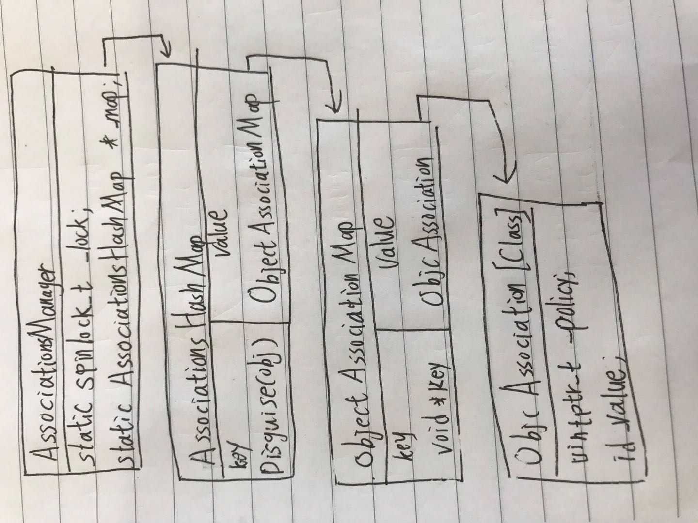

## 关联
关联是在类的定义之外为类增加额外的存储空间。<br/>
使用关联，我们可以不用修改类的定义而为其对象增加存储空间。在无法访问到类的源码的时候或者是考虑到二进制兼容性的时候是非常有用。<br/>
关联是可以保证被关联的对象在关联对象的整个生命周期都是可用的。

## 使用方式
1. 创建分类和声明属性
```objectivec
@interface NSObject (AssociatedObject)
@property (nonatomic, strong) id associatedObject;
@end
```
2. 手动实现setter和getter方法
```objectivec
@implementation NSObject (AssociatedObject)
@dynamic associatedObject;

- (void)setAssociatedObject:(id)object {
     objc_setAssociatedObject(self, @selector(associatedObject), object, OBJC_ASSOCIATION_RETAIN_NONATOMIC);
}

- (id)associatedObject {
    return objc_getAssociatedObject(self, @selector(associatedObject));
}
```
关联是基于关键字key的，允许我们给任何的实例对象添加任意数量的关联对象，只要保证关键字的唯一性即可。<br/>
关键字建议不要使用_cmd,当swizzing此方法时，swizzing方法前后的_cmd值不相同，也就会取不到对应的值；可以使用下面三种方式声明

方式|声明|使用
---|:--:|:--:
char|static char kAssociatedObjectKey|&kAssociatedObjectKey
void *|static void *kAssociatedObjectKey = &kAssociatedObjectKey|kAssociatedObjectKey
SEL|SEL sel = @selector(xxx)|sel


## 数据结构图


```objectivec
class AssociationsManager {
    // associative references: object pointer -> PtrPtrHashMap.
    static AssociationsHashMap *_map;
    ...
};

class AssociationsHashMap : public unordered_map<disguised_ptr_t, ObjectAssociationMap *, DisguisedPointerHash, DisguisedPointerEqual, AssociationsHashMapAllocator> {
    public:
        void *operator new(size_t n) { return ::malloc(n); }
        void operator delete(void *ptr) { ::free(ptr); }
    };
```
`AssociationsManager`是一个全局的manager，用于管理程序中所有关联对象的HashMap<br/>
`AssociationsHashMap`是一个无序的集合，以`disguised_ptr_t`为key，以`ObjectAssociationMap`为value
<br/>
<br/>

```objectivec
class ObjectAssociationMap : public std::map<void *, ObjcAssociation, ObjectPointerLess, ObjectAssociationMapAllocator> {
    public:
        void *operator new(size_t n) { return ::malloc(n); }
        void operator delete(void *ptr) { ::free(ptr); }
    };
    typedef ObjcAllocator<std::pair<const disguised_ptr_t, ObjectAssociationMap*> > AssociationsHashMapAllocator;
    class AssociationsHashMap : public unordered_map<disguised_ptr_t, ObjectAssociationMap *, DisguisedPointerHash, DisguisedPointerEqual, AssociationsHashMapAllocator> {
    public:
        void *operator new(size_t n) { return ::malloc(n); }
        void operator delete(void *ptr) { ::free(ptr); }
    };
```
`ObjectAssociationMap`是一个继承自std::map的集合对象，以`void *`为key，以`ObjcAssociation`为value<br/>
这里的`key`就是我们执行`objc_setAssociatedObject`时传递的key
<br/>
<br/>


```objectivec
class ObjcAssociation {
        uintptr_t _policy;
        id _value;
        ...
    };
```
终于看到了庐山真面目了，`ObjcAssociation`用于存储关联对象以及它的引用方式


## 开放的接口
```objectivec
OBJC_EXPORT void
objc_setAssociatedObject(id _Nonnull object, const void * _Nonnull key,
                         id _Nullable value, objc_AssociationPolicy policy)
    OBJC_AVAILABLE(10.6, 3.1, 9.0, 1.0, 2.0);
    
OBJC_EXPORT id _Nullable
objc_getAssociatedObject(id _Nonnull object, const void * _Nonnull key)
    OBJC_AVAILABLE(10.6, 3.1, 9.0, 1.0, 2.0);

OBJC_EXPORT void
objc_removeAssociatedObjects(id _Nonnull object)
    OBJC_AVAILABLE(10.6, 3.1, 9.0, 1.0, 2.0);
```
`objc_setAssociatedObject`是添加关联对象<br/>
`objc_getAssociatedObject`是获取关联对象的值<br/>
`objc_removeAssociatedObjects`是移除所有关联对象，文档中建议我们不要使用此方法清除关联对象。当我们清除所有的关联对象时不能保证可其他地方正在使用关联对象而导致的功能缺失；
移除时建议使用`objc_setAssociatedObject`且value为nil来移除自己添加的关联对象，遵循哪里添加哪里移除的原则。

## associatedObject的内存管理
```objectivec
typedef OBJC_ENUM(uintptr_t, objc_AssociationPolicy) {
    OBJC_ASSOCIATION_ASSIGN = 0,           /**assign */
    OBJC_ASSOCIATION_RETAIN_NONATOMIC = 1, /**< Specifies a strong reference to the associated object. 
                                            *   The association is not made atomically. */
    OBJC_ASSOCIATION_COPY_NONATOMIC = 3,   /**< Specifies that the associated object is copied. 
                                            *   The association is not made atomically. */
    OBJC_ASSOCIATION_RETAIN = 01401,       /**< Specifies a strong reference to the associated object.
                                            *   The association is made atomically. */
    OBJC_ASSOCIATION_COPY = 01403          /**< Specifies that the associated object is copied.
                                            *   The association is made atomically. */
};
```
引用关系中值得说明的是`OBJC_ASSOCIATION_ASSIGN`，相当于时assign，不同于weak<br/>
在dealloc中不需要显性的移除关联对象，因为runtime已经帮我们实现了这个功能<br/>
NSObject中的dealloc方法的调用关系：dealloc->_objc_rootDealloc->objc_object::rootDealloc->object_dispose->objc_destructInstance
```objectivec
void *objc_destructInstance(id obj) 
{
    if (obj) {
        // Read all of the flags at once for performance.
        bool cxx = obj->hasCxxDtor();
        bool assoc = obj->hasAssociatedObjects();

        // This order is important.
        if (cxx) object_cxxDestruct(obj);
        if (assoc) _object_remove_assocations(obj);
        obj->clearDeallocating();
    }

    return obj;
}
```
`objc_destructInstance`中我们看到会调用`_object_remove_assocations`来移除关联对象的引用关系

```objectivec
void _object_remove_assocations(id object) {
    vector< ObjcAssociation,ObjcAllocator<ObjcAssociation> > elements;
    {
        AssociationsManager manager;
        AssociationsHashMap &associations(manager.associations());
        if (associations.size() == 0) return;
        disguised_ptr_t disguised_object = DISGUISE(object);
        AssociationsHashMap::iterator i = associations.find(disguised_object);
        if (i != associations.end()) {
            // copy all of the associations that need to be removed.
            ObjectAssociationMap *refs = i->second;
            for (ObjectAssociationMap::iterator j = refs->begin(), end = refs->end(); j != end; ++j) {
                elements.push_back(j->second);
            }
            // remove the secondary table.
            delete refs;
            associations.erase(i);
        }
    }
    // the calls to releaseValue() happen outside of the lock.
    for_each(elements.begin(), elements.end(), ReleaseValue());
}
```
`_object_remove_assocations`实现思路：通过manager取得全局的`AssociationsHashMap`,在map中通过object的`DISGUISE`key取得实例对象对应的`ObjectAssociationMap`。
上面我们已经说过`ObjectAssociationMap`就是存储某个实例对象的关联对象集合，在这里会遍历ObjectAssociationMap的每一个元素，执行`ReleaseValue`并从集合中移除

```objectivec
static void releaseValue(id value, uintptr_t policy) {
    if (policy & OBJC_ASSOCIATION_SETTER_RETAIN) {
        return objc_release(value);
    }
}

inline void
objc_object::release()
{
    assert(!isTaggedPointer());

    if (fastpath(!ISA()->hasCustomRR())) {
        rootRelease();
        return;
    }

    ((void(*)(objc_object *, SEL))objc_msgSend)(this, SEL_release);
}
```
`ReleaseValue`最终会根据关联对象的policy执行相应的release方法

                                     
