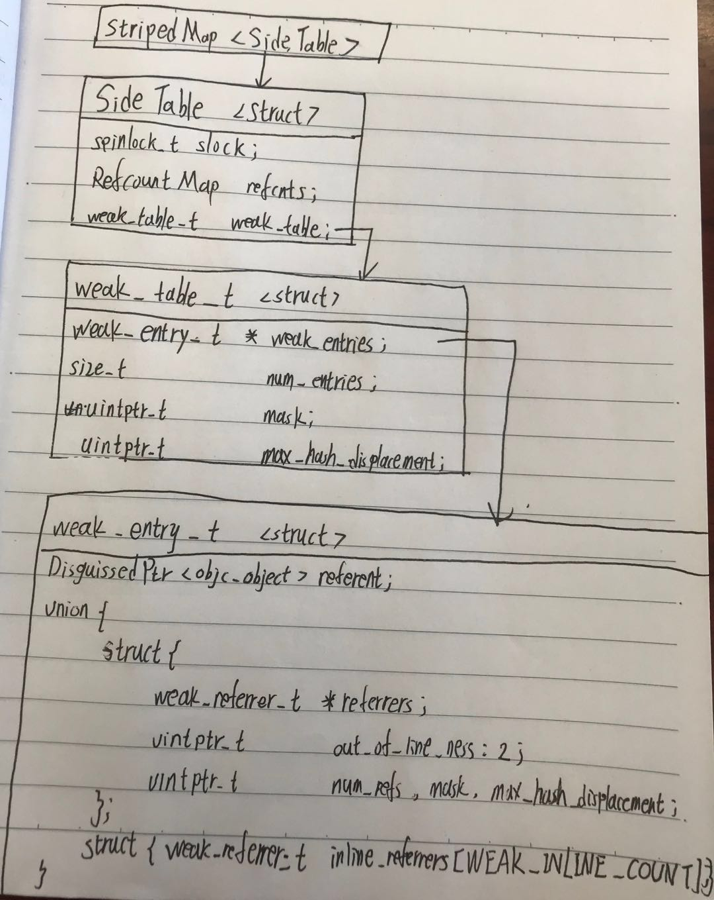
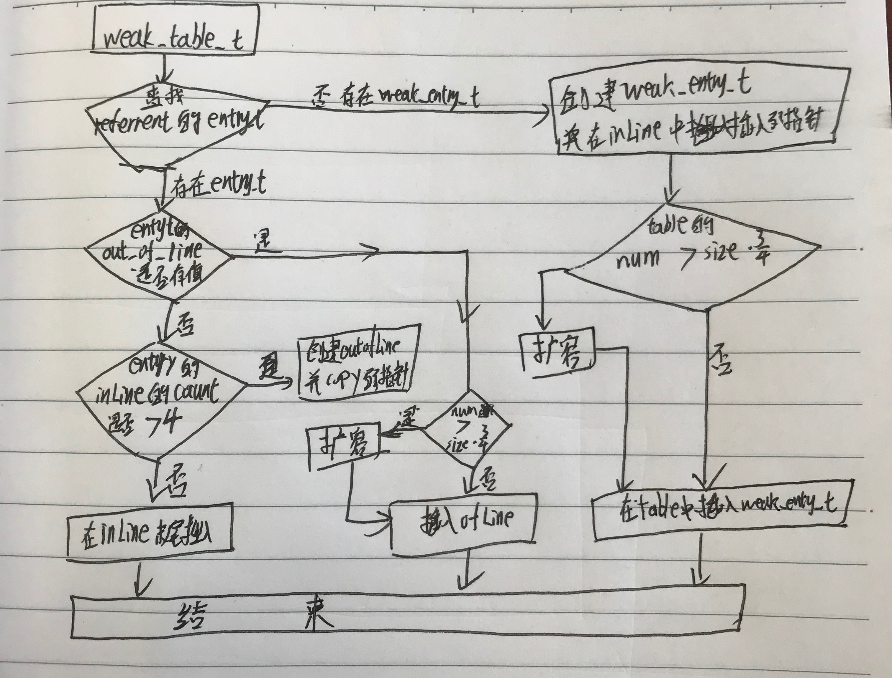

## weak
简单来说weak就是，不增加对象的retainCount，当引用对象释放时弱引用指针自动置为nil来避免错误的内存访问(指针访问是安全的)。可以用于解决循环引用的问题。

## weak的数据结构--存储结构

如上图所示，有一个全局的`stripedMap<SideTable>`字典,`StripedMap`的结构如下：

```objectivec
enum { CacheLineSize = 64 };
class StripedMap {
#if TARGET_OS_IPHONE && !TARGET_OS_SIMULATOR
    enum { StripeCount = 8 };
#else
    enum { StripeCount = 64 };
#endif

    struct PaddedT {
        T value alignas(CacheLineSize);
    };

    PaddedT array[StripeCount];

    static unsigned int indexForPointer(const void *p) {
        //类型转换
        uintptr_t addr = reinterpret_cast<uintptr_t>(p);
        //取hash值
        return ((addr >> 4) ^ (addr >> 9)) % StripeCount;
    }

 public:
    T& operator[] (const void *p) { 
        return array[indexForPointer(p)].value; 
    }
    const T& operator[] (const void *p) const { 
        return const_cast<StripedMap<T>>(this)[p]; 
    }
};
```
`StripedMap`实际是一个长度对齐且固定的散列数组，长度是`StripeCount`，每个元素的大小是`CacheLineSize`。<br/>
重载了`[]`运算符方便元素的存取。<br/>
通过实例对象的地址和`indexForPointer`计算下标，进而取得对应的`SideTable`。hash算法是：实例地址分别`右移`4位和9位得到的两个结果做`异或`运算，得到的新数与StripeCount做`取余`运算,最终得到hash值。最后的取余操作保证了hash值的均匀分布<br/>
一般情况是对整个散列表加锁，但程序运行时实例对象的数量非常大，对`StripedMap`的访问会非常频繁，如果每访问一次就对map加锁，会导致程序卡顿，所以为了降低锁的竞争，减少锁的粒度，使用`分离锁`技术---给每个元素加锁而不是整个hash表加锁，同时也增加锁的伸缩性。<br/>
程序运行时会创建成百上千个对象，而stripedMap的长度只有64，所以hash冲突的概率会非常大，所以这样一个SideTable中存储多个实例对象的引用关系和状态值。下面就进一步看看`SideTable`的结构：
```objectivec
struct SideTable {
    spinlock_t slock;
    RefcountMap refcnts;
    weak_table_t weak_table;
    ...
};
```
`spinlock_t`是一种自旋锁，适用于锁使用时间很短的情况，保证线程的安全和效率；<br/>
`refcnts`代表实例对象们的引用计数，这里我们先不做讨论。<br/> 
`weak_table`存储弱引用关系的引用表，是我们重点讨论的结构类型。其结构如下：
```objectivec
struct weak_table_t {
    weak_entry_t *weak_entries;
    size_t    num_entries;
    uintptr_t mask;
    uintptr_t max_hash_displacement;
};
```
`weak_table_t`是一个散列表，以实例对象地址的hash值为key，以`weak_entry_t`数组为value。<br/>
到这一级hash冲突几乎不会发生，一个hash地址对应一个实例对象的弱引用关系。<br/>
`weak_table_t`是真正存储弱引用关系的结构，其结构如下：
```objectivec
#define WEAK_INLINE_COUNT 4
#define REFERRERS_OUT_OF_LINE 2
struct weak_entry_t {
    DisguisedPtr<objc_object> referent;
    union {
        struct {
            weak_referrer_t *referrers;
            uintptr_t        out_of_line_ness : 2;
            uintptr_t        num_refs : PTR_MINUS_2;
            uintptr_t        mask;
            uintptr_t        max_hash_displacement;
        };
        struct {
            // out_of_line_ness field is low bits of inline_referrers[1]
            weak_referrer_t  inline_referrers[WEAK_INLINE_COUNT];
        };
    };
    
    bool out_of_line() {
        return (out_of_line_ness == REFERRERS_OUT_OF_LINE);
    }
};
```
`referent`是弱引用指针指向对象的地址;`referrers`和`inline_referrers`是一个联合体,用于存储弱引用的指针，少于REFERRERS_OUT_OF_LINE时用`inline_referrers`存储弱引用指针，否则用`referrers`;通过`out_of_line`方法判断当前联合体是哪个结构<br/>

这里的数据结构就好比现实生活中的公寓：
全局的SideTables-->sidetable-->weak_table_t-->weak_entry_t（实例和多个弱引用指针）
    公寓        -->  楼栋   -->     楼层    --> 房间（房间和多个床位）
实例的地址--->xx小区1号楼606，根据地址找到最小单元weak_wentry_t和房间

## weak数据结构的增删改
通过weak的数据结构我们知道，真正存储弱引用关系的是`weak_entry_t`数据。同时在`objc-weak.h`中还定义了修改弱用用关系的方法。
```objectivec
/// Adds an (object, weak pointer) pair to the weak table.
id weak_register_no_lock(weak_table_t *weak_table, id referent, 
                         id *referrer, bool crashIfDeallocating);

/// Removes an (object, weak pointer) pair from the weak table.
void weak_unregister_no_lock(weak_table_t *weak_table, id referent, id *referrer);

/// Called on object destruction. Sets all remaining weak pointers to nil.
void weak_clear_no_lock(weak_table_t *weak_table, id referent);
```
`weak_register_no_lock`是添加一个弱引用指针和指向，如果sideTable总找不到就新建一个weak_entry_t到weak_table_t中，其实现如下图：

`weak_unregister_no_lock`是移除某一对弱引用，逻辑是：首先找到weak_entry_t，然后在inLine或outIfLine中对应的弱指针置为nil，如果移除的是最后一个弱指针，那么就把entry从weak_table_t中移除<br/>
`weak_clear_no_lock`是清空对象的所有弱指针，逻辑是：1.找到weak_entry_t，2.遍历inLine或outIfLine将所有弱指针都置为nil，3.entry从weak_table_t中移除<br/>
`weak_register_no_lock`和`weak_unregister_no_lock`是被`storeWeak`触发的。`storeWeak`的实现如下：
```objectivec
template <HaveOld haveOld, HaveNew haveNew,
          CrashIfDeallocating crashIfDeallocating>
static id 
storeWeak(id *location, objc_object *newObj)
{
    assert(haveOld  ||  haveNew);
    if (!haveNew) assert(newObj == nil);

    Class previouslyInitializedClass = nil;
    id oldObj;
    SideTable *oldTable;
    SideTable *newTable;

 retry:
    if (haveOld) {
        oldObj = *location;
        oldTable = &SideTables()[oldObj];
    } else {
        oldTable = nil;
    }
    if (haveNew) {
        newTable = &SideTables()[newObj];
    } else {
        newTable = nil;
    }

    //加锁
    SideTable::lockTwo<haveOld, haveNew>(oldTable, newTable);
    
    //各种数据和情况判断：是否取到正确的旧table、新值是否已经执行initialize
    ....

    // 清除location弱指针的旧值
    if (haveOld) {
        weak_unregister_no_lock(&oldTable->weak_table, oldObj, location);
    }

    // 给newObj对象增加新的弱指针
    if (haveNew) {
        newObj = (objc_object *)
            weak_register_no_lock(&newTable->weak_table, (id)newObj, location, 
                                  crashIfDeallocating);
        // weak_register_no_lock returns nil if weak store should be rejected

        // Set is-weakly-referenced bit in refcount table.
        if (newObj  &&  !newObj->isTaggedPointer()) {
            newObj->setWeaklyReferenced_nolock();
        }

        // Do not set *location anywhere else. That would introduce a race.
        *location = (id)newObj;
    }
    else {
        // No new value. The storage is not changed.
    }
    //解锁
    SideTable::unlockTwo<haveOld, haveNew>(oldTable, newTable);

    return (id)newObj;
}
```
思路很清晰：给弱指针旧的指向对象做清除操作，给新的对象增加弱引用指针地址，返回新指向的对象<br/>

`weak_clear_no_lock`是在对象销毁时会被调用。`dealloc`->`_objc_rootDealloc`->`objc_object::rootDealloc`->`object_dispose`->`objc_destructInstance`
```objectivec
void *objc_destructInstance(id obj) 
{
    if (obj) {
        // Read all of the flags at once for performance.
        bool cxx = obj->hasCxxDtor();
        bool assoc = obj->hasAssociatedObjects();

        // This order is important.
        if (cxx) object_cxxDestruct(obj);//清除属性、变量
        if (assoc) _object_remove_assocations(obj);//清除关联对象
        obj->clearDeallocating();//清空SideTable中的RefcountMap和weak_entry_t
    }

    return obj;
}
```
`objc_object::sidetable_clearDeallocating`最终会调用到`weak_clear_no_lock`和`RefcountMap::erase` 。`weak_clear_no_lock`前面已经分析过了，`RefcountMap::erase`是ARC相关的，这里我们只做了解先不详细展开。<br/><br/>

综上所述：weak_table_t的修改是通过`storeWeak`和`dealloc`两个方法触发。下面我们就研究`storeWeak`是怎么样被调用的。

## weak实践
明白了weak的存储结构和修改方法等一些内部实现技术原理后，我们在编写什么样的代码时会执行这些内部实现呢。
### 声明或赋值__weak指针
```objectivec
//1.声明弱引用指针
__weak id weakObj;
//2.声明并初始化弱引用指针
__weak NSObject* weakObj = [[NSObject alloc]init];
//3.给@property(nonatomic,weak)id weakObj;属性赋值时
self.weakObj = [[NSObject alloc]init];
//4.修改弱引用指针
__weak NSObject* weakObj = [[NSObject alloc]init];
weakObj = self.view;
```
上面这些情况都会调用到`objc_initWeak`
```objectivec
id
objc_initWeak(id *location, id newObj)
{
    if (!newObj) {
        *location = nil;
        return nil;
    }

    return storeWeak<DontHaveOld, DoHaveNew, DoCrashIfDeallocating>
        (location, (objc_object*)newObj);
}
```
`objc_initWeak`的实现是：做非空判断后调用`storeWeak`方法，这个方法上面我们也已经分析过了。

### copy弱引用指针
```objectivec
__weak id weakObj = self.view;
__weak id weakObj2 = weakObj;
```
给weakObj赋值会调用到`objc_initWeak`，但是给weakObj2赋值时会调用到`objc_copyWeak`
```objectivec
void
objc_copyWeak(id *dst, id *src)
{
    id obj = objc_loadWeakRetained(src);
    objc_initWeak(dst, obj);
    objc_release(obj);
}
```
### 使用弱引用指针
```objectivec
//1.
__weak NSObject* weakObj = [[NSObject alloc]init];
NSLog(@"%@",weakObj);
//2.
__weak id weakObj = self.view;
NSLog(@"%@",weakObj);
```
第一种情况会直接调用`objc_loadWeakRetained`,第二种情况会调用`objc_loadWeak`。
```objectivec
id
objc_loadWeakRetained(id *location)
{
    id obj;
    id result;
    SideTable *table;
    obj = *location;
    .....
    if (!obj) return nil;
    if (obj->isTaggedPointer()) return obj;
   
    table = &SideTables()[obj];
    table->lock();
    ...
    
    result = obj;
    table->unlock();
    return result;
}

id
objc_loadWeak(id *location)
{
    if (!*location) return nil;
    return objc_autorelease(objc_loadWeakRetained(location));
}
```
二者的区别:是否加入自动释放池。第一种情况应该是编译器根据变量的使用情况知道，不必加入自动释放池就能保证弱引用指针在使用期间一直能访问到。第二种情况编译器为了保证弱引用指针在使用期间其间不被释放，所以加入到自动释放池。

### 释放弱引用指针
在方法结束，弱引用指针变量释放，就会调用到`objc_destroyWeak`方法。
```objectivec
void
objc_destroyWeak(id *location)
{
    (void)storeWeak<DoHaveOld, DontHaveNew, DontCrashIfDeallocating>
        (location, nil);
}
```
其实就是给指针弱引用指针赋nil值，删除这个弱引用指针。

## StripedMap的初始化
到此我们明白了weak的实现原理和使用，所有这些都是以sidetable为基础的，那么这个sidetable是在什么时候创建初始化的呢？<br/>
我们知道iOS中的libobjc.dylib动态库中包含objc和runtime的源码，所以在加载这个动态库的时候会调用到`_objc_init`
```objectivec
void _objc_init(void)
{
    static bool initialized = false;
    if (initialized) return;
    initialized = true;
    
    // fixme defer initialization until an objc-using image is found?
    environ_init();//初始化全局变量
    tls_init();//线程相关的一些设置
    static_init();//静态变量初始化
    lock_init();//一些锁的初始化
    exception_init();//错误处理相关

    _dyld_objc_notify_register(&map_images, load_images, unmap_image);//循环的调用map_image、load_images、unmap_image
}
```
初始化一些全局变量，静态变量之后，开始加载镜像文件并解析镜像文件。
### map_images
`map_images`会调用到`map_images_nolock`
```objectivec
void 
map_images_nolock(unsigned mhCount, const char * const mhPaths[],
                  const struct mach_header * const mhdrs[])
{
    static bool firstTime = YES;
    header_info *hList[mhCount];
    uint32_t hCount;
    size_t selrefCount = 0;
    //存储要加载文件数组hList、计算SEL选择子的个数 
    //代码省略
    ....
    
    if (firstTime) {
        sel_init(selrefCount);//创建SEL大表
        arr_init();//1初始化自动释放池、2调用SideTableInit来初始化StripedMap<SideTable>
        .....
    }

    //读取文件内容
    if (hCount > 0) {
        _read_images(hList, hCount, totalClasses, unoptimizedTotalClasses);
    }

    firstTime = NO;
}
```
`map_images`就是做了读取镜像文件到内存，创建SEL大表，初始化StripedMap<SideTable>

### load_images
`load_images`就是`+load`方法调用的两个阶段<br/><br/>


## 总结
* 弱引用是通过一个全局的`SideTable`中的`weak_table_t`来存储弱引用指针和对象的键值对
* 当对象销毁时通过调用`weak_clear_no_lock`把所有指向该对象的弱指针都置为nil。
* `StripedMap<SideTable>`的初始化在自动释放池创建之后，在load和initialize之前


